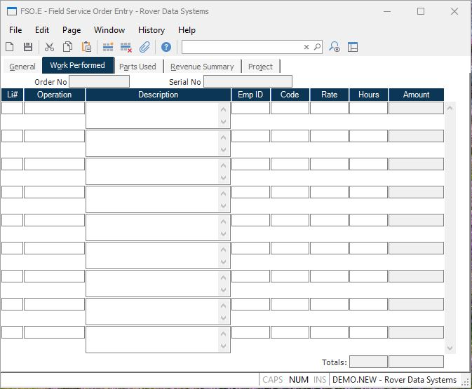

##  Field Service Order Entry (FSO.E)

<PageHeader />

##  Work Performed

**Order No** Contains the order number for display purposes only.  
  
**Serial No** Contains the serial number for display purposes only.  
  
**Oper Li** Enter the line item number of the operation being documented. This
is usually entered as a sequential number beginning with one (1).  
  
**Operation** Enter the operation code that identifies the operation
performed.  
  
**Oper.Desc** Enter the description of the operation performed. This will be
loaded automatically when an operation code has been entered.  
  
**Oper Emp ID** Enter the identification number of the employee who performed
the operation. The system will automatically load the last employee number you
entered, which you may change as required.  
  
**Service Code** Enter the service code that identifies how and if this
operation is to be billed, and if it is chargeable to the customer, OEM
warranty, or an internal warranty.  
  
**Oper Rate** Enter the rate at which this operation is to be charged to the
customer. The system will load the rate based on the zone and service code
entered. It may be changed as required.  
  
**Oper Hours** Enter the number of hours to be charged against the operation.
Partial hours are stated as a fraction of an hour. For example, one hour and
fifteen minutes would be entered as 1.25 not 1:15.  
  
**Amount** Shows the amount to be charged for the associated operation. This
is calculated as the hours times the rate.  
  
**Total Hours** Displays the total number of hours for all operations
performed on the service order.  
  
**Labor Total** Contains the sum of the labor amounts for each operation
entered.  
  
  
<badge text= "Version 8.10.57" vertical="middle" />

<PageFooter />