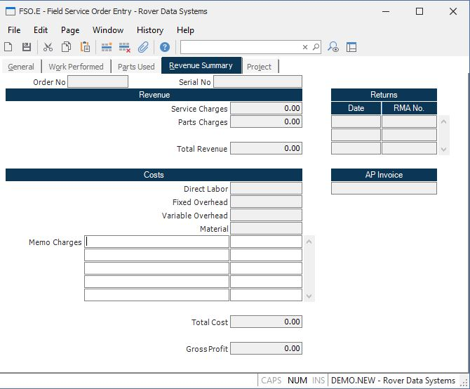

##  Field Service Order Entry (FSO.E)

<PageHeader />

##  Revenue Summary

**Order No** Displays the service order number.  
  
**Serial No** Displays the serial number of the equipment.  
  
**Service Revenue** Contains the total dollar amount in service revenue for
the order.  
  
**Parts Revenue** Displays the total reveune from parts for the order.  
  
**Total Revenue** Contains the total revenue generated from the order.  
  
**Labor Cost** Contains the total direct labor cost charged to the order.  
  
**Labor FOH** Contains the total amount of fixed overhead charged to the
order.  
  
**Labor VOH** Contains the total amount of variable overhead charged to the
order.  
  
**Total Material** Display the total cost of materials used on the order.  
  
**Memo Cost Desc** Enter any additional costs that are to be included in the
order. Note: there is no accounting transaction generated as a result of
entering these costs. They serve only as a notation of a cost posted
elsewhere. For example, freight may be paid through accounts payable, but is
added to the order here for reference.  
  
**Memo Cost** Enter the dollar amount of the cost described on the associated
line.  
  
**Total Cost** Dislplays the total of all costs for the order.  
  
**Net Revenue** Displays the net revenue generated by the order.  
  
**Rma Date** The date the associated RMA number was entered.  
  
**Rma Number** The RMA number that was generated for this field service order.  
  
**Ap Id** If an A/P invoice was created to reimburse the vendor for a
chargeback/warranty type order, it will appear in this field. It is displayed
for reference only and cannot be changed. The A/P invoice is created when the
field service order is posted.  
  
  
<badge text= "Version 8.10.57" vertical="middle" />

<PageFooter />