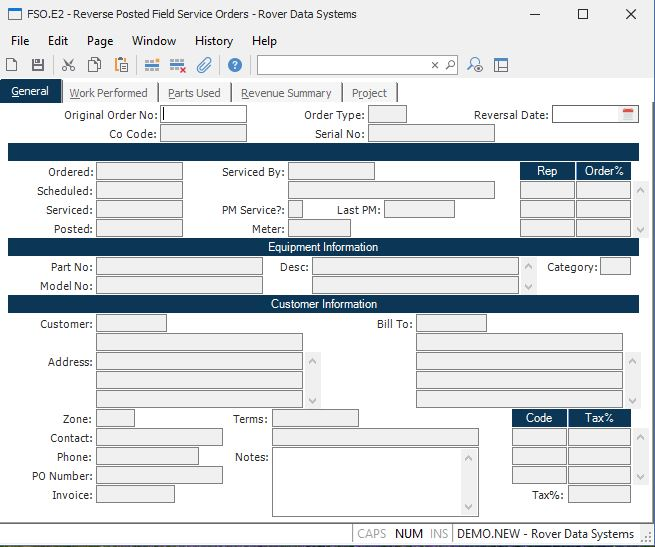

##  Reverse Posted Field Service Orders (FSO.E2)

<PageHeader />

##  General

**Order No** This is the order number key that will be automatically assigned
upon filing the reversal.  
  
**Original FSO ID** Enter the field service oder number you want to reverse.
Only orders with a status of "P" (posted) may be reversed.  
  
**Co Code** Enter the company code this record should be applied to. The
company code must be predefined in the CO.CONTROL procedure. If only one
company code exists, it will automatically be inserted into this record for
you.  
  
**Order Type** Enter the code that identifies the type of order being
processed.  
  
**Serial No** Enter the serial number of the equipment serviced by this order.
You may leave this field blank if there is no serial number available, however
the service history for the serial number will not be updated.  
  
**Service Date** Enter the date on which the reversal is to be processed. It
must not be before the original service date or post date.  
  
**Order Date** Original order date.  
  
**Schedule Date** Original scheduled date.  
  
**Orig Service** Original service date.  
  
**Post Date** Original Post date.  
  
**Service Unit** Enter the identification of the service unit (van, truck
etc.) that was used in performing the service.  
  
**Service Unit Description** Contains the description of the service unit used
to perform the service. It may not be changed.  
  
**PM Service?** Enter the letter "Y" if preventive maintenance was performed
on the equipment as part of the service order.  
  
**Last PM Date** Displays the last preventive maintenance date as recorded in
the Serial file.  
  
**Meter** Enter the reading taken from the meter on the equipment at the time
the service was performed. For example, miles or hours.  
  
**Rep** Enter the identification of each representative involved in carrying
out the service order. These will be loaded automatically based on the service
unit entered, but may be changed as required.  
  
**Order Pct** Enter the percentage to be used in determining the level of
credit given to each rep for their involvement in carrying out the service
order. These percentages affect are used along with the commission percentage
to determine the amount of commission to be paid.  
  
**Equipment Part** Enter the part number of the equipment being serviced.  
  
**Equipment Model** Enter the model number of the equipment being serviced.
This information may be loaded automatically based on the part number entered.  
  
**Equipment Desc** Enter the description of the equipment being serviced. This
information is loaded from the Serial file when available.  
  
**Category** Displays the category defined in the parts master for the
equipment.  
  
**Cust No** Enter the number of the customer associated with the equipment.
This may be the owner or renter of the equipment. When available this
information will be loaded automatically from the Serial file.  
  
**Customer Name** Contains the name of the customer as it appears on the
customer master file. It may not be changed.  
  
**Address** Enter the address at which the equipment resides and the service
is to be performed.  
  
**Bill To** Enter the number of the customer that is to be billed for the
service order.  
  
**Bill To Name** Contains the name of the bill to customer for the order. It
may not be changed.  
  
**Bill To Addres** Contains the address of the customer to be billed for the
service order.  
  
**Zone** Enter the geographic zone within which the equipment resides. The
zone is used in the calculation of service rates.  
  
**Contact** Enter the name of the person to contact at the customer regarding
the service order.  
  
**Phone** Enter the phone number of the contact person at the customer site.  
  
**PO Number** Enter the purchase order number assigned by the customer for the
service order. This number will be referenced on the invoice.  
  
**Invoice Number** Contains the invoice number assigned for the service order. This number is assigned at the time the invoice is created during the posting of the order with [ FSO.P1 ](../../../../../rover/FS-OVERVIEW/FS-PROCESS/FSO-P1/README.md) . It may not be changed.   
  
**Terms** Enter the terms code that defines the payment requirments for the
service order.  
  
**Terms Description** Contains the description of the payment terms defined by
the terms code. This may not be changed.  
  
**Notes** Enter any notes applicable to the service order.  
  
**Tax Code** Enter each of the tax codes that applies to the address at which
the equipment resides.  
  
**Tax Percent** Contains the percentage of the associated tax code.  
  
**Total Tax%** Contains the sum of all the individual tax percentages.  
  
  
<badge text= "Version 8.10.57" vertical="middle" />

<PageFooter />