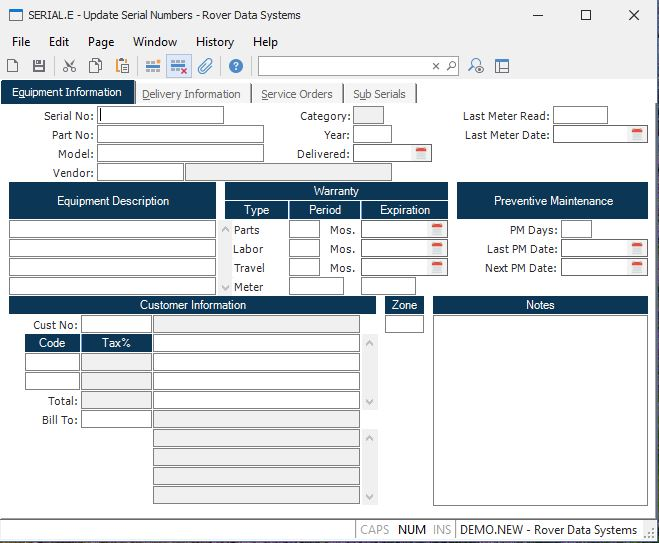

##  Update Serial Numbers (SERIAL.E)

<PageHeader />

##  Equipment Information

**Serial ID** Enter the serial number which you wish to update. You may enter
an existing serial to update/change that specific record, or you may enter a
new serial number to create a new record.  
  
**Serial Number** Enter the serial number which you wish to update. You may
enter an existing serial to update/change that specific record, or you may
enter a new serial number to create a new record. After entry of the serial
number, if more than one serial record exists for that number, then a list
will be displayed with the associated part numbers for selection and a button
for the option of creating a new serial record.  
  
**Part** The part number to which this serial number is assigned. A serial
number can exist for multiple part numbers, but the part number cannot be
changed on an existing serial record.  
  
**Model** Contains the model number as found on the parts master file. The
field is loaded initially from the parts master, but may be entered manually.  
  
**Vendor** Enter the identification of the primary vendor to be debited for warranty charges against this serial number. If this serial number is entered in the field service order entry ( [ FSO.E ](../../../../../rover/FS-OVERVIEW/FS-ENTRY/FS-CONTROL/FSO-E) ) procedure, this vendor will be loaded into FSO record for you but can be changed in [ FSO.E ](../../../../../rover/FS-OVERVIEW/FS-ENTRY/FS-CONTROL/FSO-E) .   
  
**Vendor Name** Contains the name of the vendor identified in the vendor
field.  
  
**Category** Displays the category of the equipment.  
  
**Model Year** Enter the year associated with the manufacture of the
equipment.  
  
**Date Delivered** Enter the date on which the equipment was delivered to the
customer. This indicates the start of the warranty period.  
  
**Last Meter Reading** Enter the last reading taken from the meter (miles,
hours etc.)  
  
**Last Meter Date** Enter the last date the meter was read.  
  
**Description** Contains the description of the equipment identified by the
serial number. This data is loaded automatically the first time a part number
is entered, and may be adjusted as required.  
  
**Parts Warranty** Enter the number of months for which replacement parts are
warranted for the equipment.  
  
**Parts Warr Date** Enter the date on which the warranty for parts on the
equipment will expire.  
  
**Labor Warranty** Enter the number of months for which labor is warranted for
this equipment.  
  
**Labor Warr Date** Enter the data on which the warranty for labor on the
equipment will expire.  
  
**Travel Warranty** Enter the number of months for which charges incurred due
to travel are warranted.  
  
**Travel War Date** Enter the date on which the warranty for travel charges on
the equipment will expire.  
  
**Meter Warranty** Enter the number of hours, miles or other measured period
for which the warranty applies.  
  
**Meter Warr Exp** Enter the maximum amount the the meter can read (e.g.
mileage hours etc.) until the warranty has lapsed.  
  
**PM Days** Enter the interval in day at which preventive maintenance is to be
performed on the equipment.  
  
**Last PM Date** Enter the date on which the last preventive maintenance was
performed on the equipment.  
  
**Next PM Date** Enter the next date on which preventive maintenance is
scheduled to be performed.  
  
**Customer** Enter the ID of the customer who owns the equipment.  
  
**Cust Name** Contains the name of the associated customer.  
  
**Equipment Address** Enter the address at which the equipment resides. This
will be loaded initially from the ship to address information for the customer
or sales order.  
  
**Tax.Code** Enter the tax codes that apply to the equipment address.  
  
**Tax Rate** Contains the the current tax rate for the associated tax code.  
  
**Total Tax** Contains the total tax rate calculated as the sum of the
individual tax rates.  
  
**Bill To** Enter the number of the customer to be billed for services.  
  
**Bill To Name** Contains the name of the Bill To customer.  
  
**Bill To Address** Contains the address of the Bill To customer.  
  
**Zone** Enter the service zone associated with the address of the equipment.
The service zone entered here will be used as the default zone for field
service orders entered for the equipment. The zone is used to determine
service rates.  
  
**Notes** Enter any notes applicable to the equipment.  
  
  
<badge text= "Version 8.10.57" vertical="middle" />

<PageFooter />