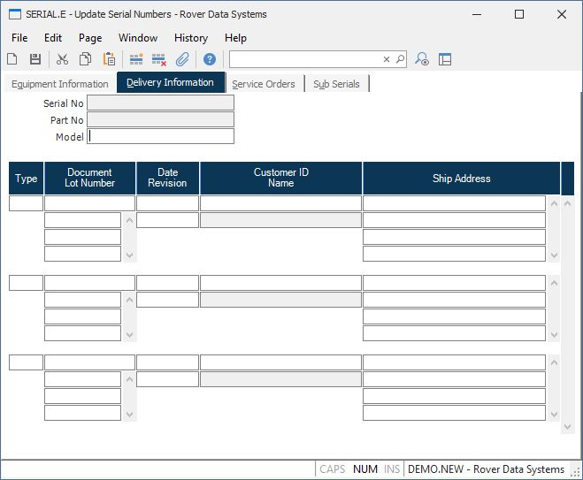

##  Update Serial Numbers (SERIAL.E)

<PageHeader />

##  Delivery Information

**Serial Number** Contains the serial number for reference only.  
  
**Part** Contains the part number for reference only.  
  
**Model** Contains the model number as found on the parts master file.  
  
**Doc Type** The type of document on which this serial number was logged (e.g.
SH = Shipment, RM = RMA, MSHIP = MSHIP).  
  
**Doc** The document number on which the serial number was logged (i.e.
shipment or RMA number).  
  
**Lot No** If the serial number is associated to a lot number then enter the
lot number in this field.  
  
**Doc Date** The date appearing on the document (e.g. shipment date or
received date).  
  
**Revision** Enter the revision of the item.  
  
**Cust** The customer number to which the part number was shipped or from whom
the part  
was received via an RMA.  
  
**Name** The customer name as is appears in the Cust file. Only the first 16
characters of the name are shown on this screen.  
  
**Ship Address** If the document is a shipment, then this field contains the
ship to address. For an RMA, this field contains the address from which the
part was returned.  
  
  
<badge text= "Version 8.10.57" vertical="middle" />

<PageFooter />