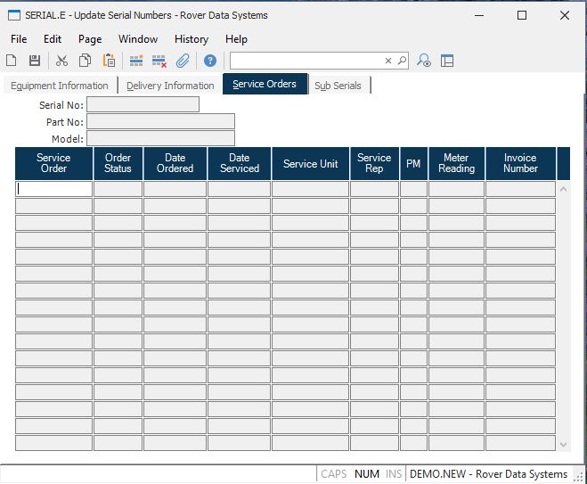

##  Update Serial Numbers (SERIAL.E)

<PageHeader />

##  Service Orders

**Serial Number** Contains the serial number for reference only.  
  
**Part** Contains the part number for reference only.  
  
**Model** Contains the model number as found on the parts master file.  
  
**FSO ID** Contains each field service order processed for the equipment.  
  
**Status** Contains the status of the associated service order.  
  
**Date Ordered** Contains the date on which the service order was placed.  
  
**Service date** Contains the date on which the service was performed on the
associated service order.  
  
**Service Unit** Contains the identification of the service unit used to
perform the service on the service order.  
  
**Rep** Contains the identification of the rep who handled the service order.  
  
**PM Service** Contains the letter "Y" if preventive maintenance was performed
on the service order.  
  
**Meter** Contains the meter reading of the equipment that was recorded on the
service order.  
  
**Invoice** Contains the invoice number assigned to the service order.  
  
  
<badge text= "Version 8.10.57" vertical="middle" />

<PageFooter />