# G/L Account Flow
### Accountant's Guide

## Introduction
This is a guide to the general ledger(G/L) entries made in the course of processing throughout M3. 

- M3 uses accrual-basis accounting method.
- Receivables and payables are recognized at the time of shipping and receiving, even though as yet no cash has been received or paid out. 
- Standard practice is to record and recognize revenues in the period in which they incur and to match them with related expenses.
- Accrual-basis is GAAP compliant
	- For further information on the differences between accrual-basis and cash basis accounting we recommend you consult education and/or professional resources. 

- Inventory transactions in M3 use the G/L account linked to an inventory location.
	- For example, when a shipment is confirmed using SHIP.E2, inventory is pulled from the inventory location referenced in the line item.
	- The result is a credit to the G/L account defined for this inventory location.
- Inventory locations are setup and defined in INVLOC.E, it is where the G/L account is linked to the named inventory location. 
- G/L entries are saved in register files in M3. There is a register file for each of the modules.
	- Accounts Receivable (AR), Accounts Payable (AP), Inventory (INV) and Work Orders (WO). The register files are named APREG, ARREG, INVREG, and WOREG.
	-	Reports such as APREG.R1, ARREG.R1, INVREG.R1 provide detailed listings of the credits and debits recorded as a result of transactions. 
	- There is an interface procedure (GLING.P1) for the periodic processing of register records to create journal entries; The journal entries are initially created in a hold status. After review, journal entries can be posted, and posted journal entries update G/L account balances.

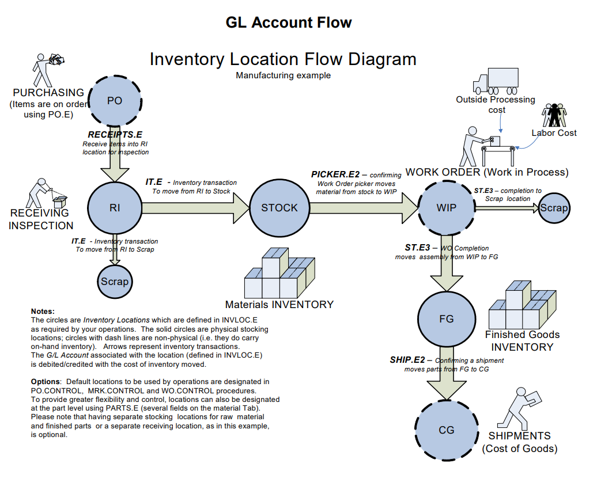

## Shipping and Accounts Receivable
In this example the inventory cost of the product was $50 when it was shipped. The product was sold and invoiced for $100. The customer got a terms discount of $2 for paying early.

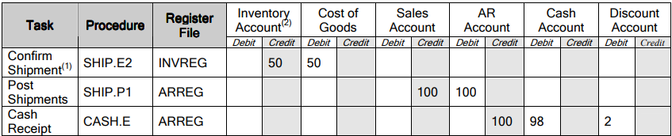

###### 1. Note: It is possible to change the quantity in SHIP.E2 after confirming (status "S") but before posting. This will result in adjusting INVREG entries whereby the original amount is reversed, and the new amount is posted.
###### 2. Parts are pulled from an inventory location at shipping. The inventory account specified in INVLOC.E for that location is one credited at shipment. 

## Reversing a Shipment and Reversing a Credit Memo
In this example the goods are moved back into inventory. The sales order is opened, and a credit memo generated after posting to AR. 

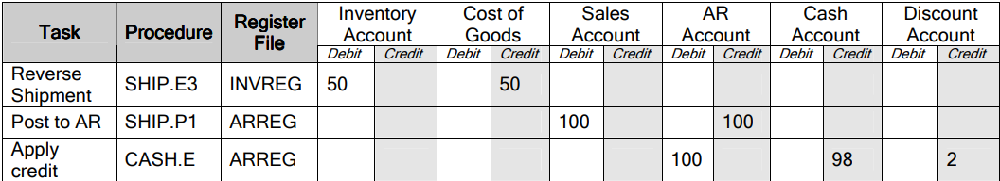

## Commissions
**If commissions are paid via COMM.P3 the following charts detail transactions that occur in addition to regular shipping and AR register transactions shown on the previous charts. The option to create commission accruals is a setting in ACCT.CONTROL**

In this example a commission of $5.00 is accrued and paid on a sold (shipped) item.
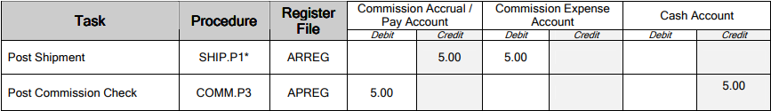
###### Note: In this example a commission was generated by a shipment. AR.E can also be used to generate or update commissions. The "Update commissions" option is set in ACCT.CONTROL. Additionally, COMM.E can be used to directly create or update commission accruals. 

In the following example an item is returned for credit. The commission of $5.00 is reversed (creating new reversing entries to the register). 

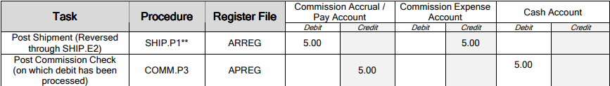
###### Note: If RMAREC.P1 is used to post items received from an RMA, commissions accrued or paid are reversed in the same way as when a shipment is reversed and posted in the example above.

## Online Credit Card Payment (with Online Processing Activated)
In this example the customer was charged $100 but only $98 was netted because the merchant service deducted $2 in fees. 
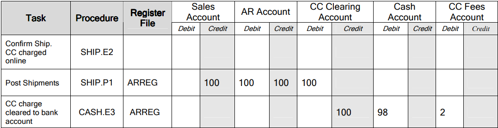
## Reversing Online Credit Card Payment by Reversing Shipment
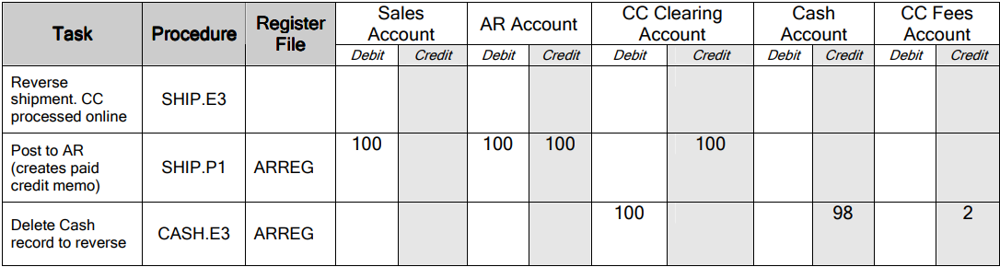

## Receiving PO and Accounts Payable
 In the examples below the purchased items costs $110 and was paid early to get the terms discount of $2.00.
 
**Inventory Items** 
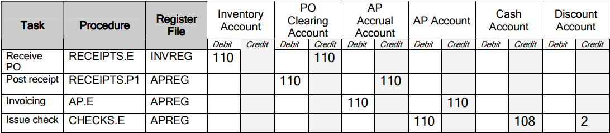

**Non-Inventory Items** 
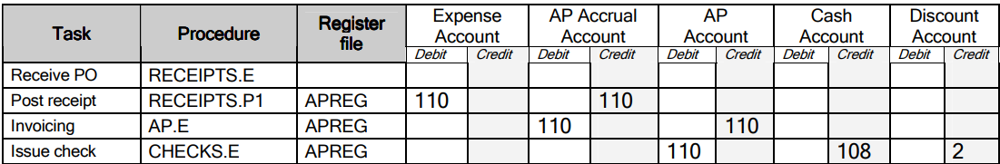

## Invoicing a Non-PO Receipt Item or Expense Directly in AP.E
In the example below the item costs $110 and was paid early to get the terms discount of $2.00. Because there was no PO issued, the invoice was entered directly in AP.E.

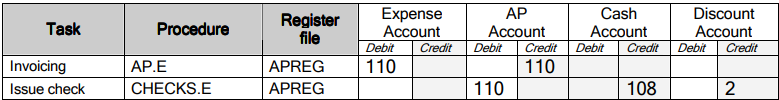

## Creating a Debit Memo for a Non-PO Item or Expense Directly in AP.E
In this example the Vendor is giving credit.

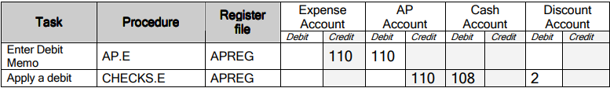

## Creating a Debit for a Returned PO Item
**Inventory Items** - In this example a purchased item is returned to the vendor for credit. 
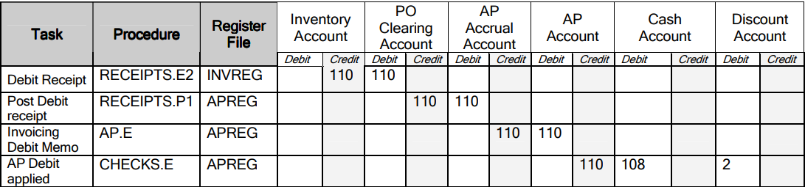
**Non-Inventory Items** - In this example an item is returned to the vendor for credit.
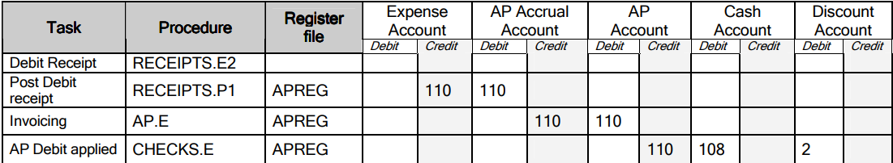

## Reversing a Receipt
This is equivalent to deleting a receipt and the AP Accrual record.
RECEITPS.E3 should only be used in certain conditions, namely, this is the one and only receipt against a PO and the complete quantity on the receipt will be reversed. 
If the receipt has been posted, the AP record must be an accrual with no changes made.
In all other cases a debit receipt must be created instead by using RECEIPTS.E2 (see previous page). 

**Inventory Items** - In this example the items cost $110 on the receipt. 
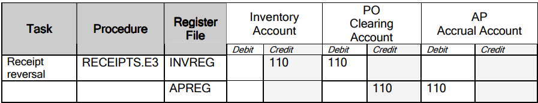

**Non-Inventory Items** - In this example the items cost $110 on the receipt.
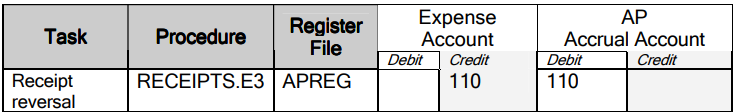

## Work Order Finalization
The table below shows a simple example where there is no labor or overhead applied or any other (material) adjustments to the WO. The value of material going in is $100, the same as the value going out.
When the work order costs are finalized, there will be no WOREG transaction, only INVREG transactions. 
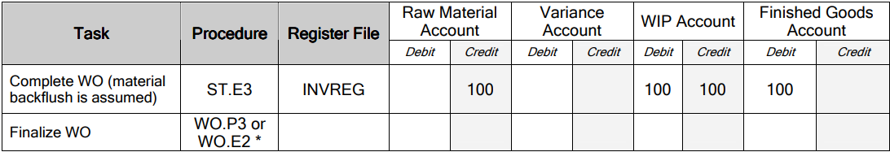

The table below shows that the material cost of $100 applied to the Work Order is different the cost of the completed part which is $150. The difference coming from WIP is credited to a variance account. If using standard costs, it is expected that the standard cost of a finished assembly includes labor and maybe overhead in addition to the cost of the components (material) so there will be difference between material dollars going in and the completion dollars to inventory. 
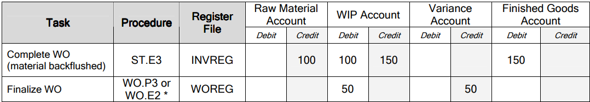
###### WO.P4 can be used to post accumulated variances incrementally in periods prior to finalizing.

## Work Orders with Labor Accrued
Costs for labor and overhead are normally *applied* to the Work Order and credited to an accrual account (as in the example below). In a standard cost system, variance accounts are credited with any remaining difference at the Work Order finalization step.

In this example, material cost is $100 and direct labor is $50. The actual payroll expanse was $60. It is probable that the amounts in the Labor Accrual (earned/applied labor) and the payroll expense (actual paid labor) will not match exactly. The difference is considered labor variance. 
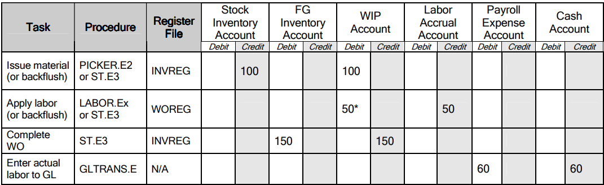
###### Note: In this example, separate inventory accounts are shown for materials and finished inventory, but this is optional. 
###### *labor is posted to the WIP account unless coded differently in LABOR.CONTROL. Different labor function codes can be setup to post indirect labor to other accounts. 

## Moving or Adjusting Inventory
When it is necessary to move inventory from one physical location (1) to another (2) as in the first example the origin and destination inventory locations must be specified in IT.E. When an inventory location is setup in INVLOC.E, the associated G/L account is specified. This account is used for the debit or credit amount. The system calculates the amount by multiplying the number of parts by the unit cost. In this example, 5 parts with the unit cost of $20 were moved. $100 is credited to one account and the same debited to the other. 
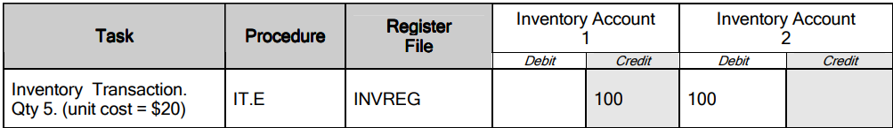

When an incorrect on-hand quantity is discovered, the adjustments can be made using IT.E. This time the offsetting account is an inventory adjustment account. This assumes you have setup an adjustment location associated with an adjustment account in INVLOC.E. When setting up the adjustment location you must use AD as the location type. In the example below, 5 parts needed to be adjusted out of inventory. This example assumes the unit cost of the part is $20. The total adjustment amount of $100 got credited to the inventory account and debited from the adjustment account. If there is a need to increase the quantity of parts in inventory, you would not move a quantity of parts from the adjustment location *to* the inventory location thus increasing the on-hand quantity (not shown in the example). 
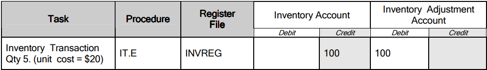

## Adjusting Inventory in an "Average Cost" Method
In the example below, when a quantity of 5 parts were moved from an adjustment account to an inventory account there was no unit cost present therefore no G/L posting occured as a result of the IT.E transaction. 
This was the inventory displayed in INV.Q before and after the IT.E transaction:

 
Before Qty= 0	Before Unit Cost = 0

After Qty= 5	 	After Unit Cost = 0
 

In an average cost environment, the next step is COSTADJ.E which is used to adjust the average cost. The average adjustment account used by COSTAOSTADJ.E is set up in INV.CONTROL.

If the accuracy of unit costs and/or on-hand quantities in question constantly it indicates that there is an underlying problem in operations or implementation which needs to be addressed. 
In the average cost environment, costs start flowing from purchase order receipts based on the actual unit cost in the PO line item. In manufacturing, additional costs are usually added to material in the work order step. In the average cost method, each time the part is received the cost is averaged. This affects the unit cost of the part in all physical locations throughout the entire cost group. 

In a "Standard Cost" method the standard cost is used as the unit cost. Standard costs are entered and maintained using the COST.E procedure. 

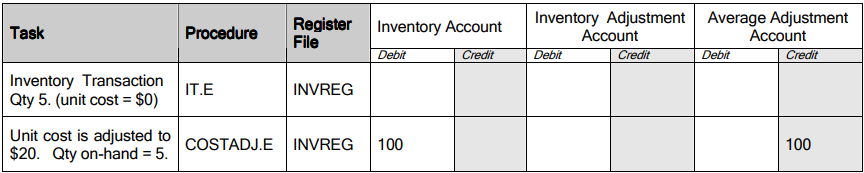
