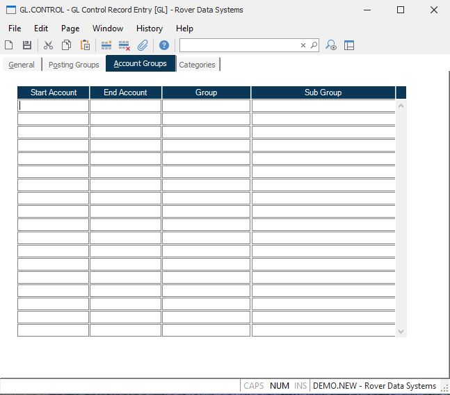

##  GL Control Record Entry (GL.CONTROL)

<PageHeader />

##  Account Groups

**Start Account** This field contains the account number, which will start the
range of account numbers, for the associated group and/or sub group.  
  
**End Account** Enter the ending account number for the range to be assigned
the associated group and/or subgroup.  
  
**Group** Enter the account group to be assigned to the range of account
numbers defined.  
  
**Sub Group** Enter the subgroup to be assigned to the range of account
numbers defined.  
  
  
<badge text= "Version 8.10.57" vertical="middle" />

<PageFooter />