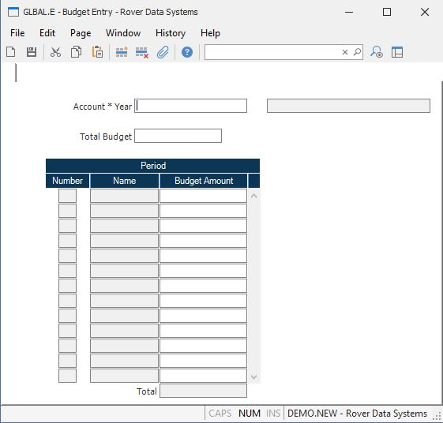

##  Budget Entry (GLBAL.E)

<PageHeader />

##

**Acct * year** This field contains an account number and a fiscal year which,
together make up the key to the GLBAL file. You can either access an existing
record to add or change budget amounts for the year, or enter a new record to
load budgets for a new, upcoming year.  
  
**Total Budget** You may enter the entire year's budget figure into this field
and the system will allocate the amount over the fiscal periods.  
  
**Per #** The period numbers are loaded from the FY record record associated
with the fiscal year entered in the record key. They cannot be changed during
this procedure.  
  
**Per name** The period names are loaded from the FY record associated with
the fiscal year enter in the record key. They cannot be changed during this
procedure.  
  
**Budget amounts** Enter the budgets for each period displayed in the FY file
for this fiscal year.  
  
**Acct desc** The account description is loaded from the GLCHART file. It
cannot be changed during this procedure. It is displayed for identification
purposes only.  
  
**Total** Contains the running total of the budget amounts entered for each
period. It may not be updated.  
  
  
<badge text= "Version 8.10.57" vertical="middle" />

<PageFooter />