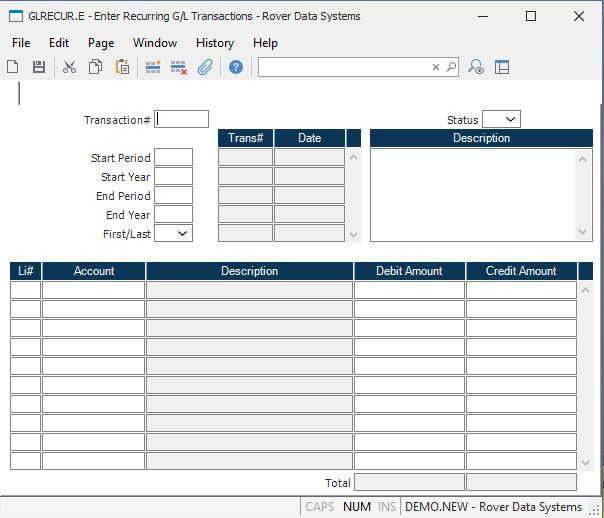

##  Enter Recurring G/L Transactions (GLRECUR.E)

<PageHeader />

##

**Gltrans ID** The number of the transaction (journal entry). For new transactions, this number will be auto- matically assigned when the record is filed. Existing numbers can be entered only if the transaction has not yet been posted (the post flag in the [ GL.CONTROL ](../../GL-CONTROL/README.md) record is set to 'H').   
  
**Status** This field contains the current status of this recurring record.
Change the status to "C" to stop from any further processing.  
  
**Start Per** Enter the period in which you wish this record to start
processing.  
  
**Start Year** Enter the fiscal year in which you wish to start processing
this recurring record.  
  
**End Per** Enter the last fiscal period in which you want this record to
process.  
  
**End Year** Enter the fiscal year in which you wish this record to stop
processing.  
  
**First/Last** If you want this record to receive a transaction date of the
first day of the fiscal period, enter 'F'. Enter 'L' to assign the last day of
the fiscal period.  
  
**Trans** This field contains a list of the transactions (journal entries)
created by this recurring record.  
  
**Trans Date** This field contains the transaction date for the associated
transactions.  
  
**Description** This is a multi-valued field used for descrip- tive notes. Any
number of notes can be entered to describe the reason for the journal entry.  
  
**Line number** The line item number is a unique identifier used to define
each account and amount be posted in this journal entry.  
  
**Account number** Enter the account number to which the associated amount on
this line will be posted. The number must exist in the GLCHART file.  
  
**Acct desc** This is the account description loaded from the GLCHART file. It
is displayed here for verific- ation only, and cannot be changed.  
  
**Debit Amt** If the amount being applied to this account is a debit, enter
the amount here.  
  
**Credit Amt** If the amount being applied to this account number is a credit,
enter the amount here.  
  
**Total Debit** The total of all amounts in the debit column.  
  
**Credit Amt** The total of all amounts in the credit column.  
  
  
<badge text= "Version 8.10.57" vertical="middle" />

<PageFooter />