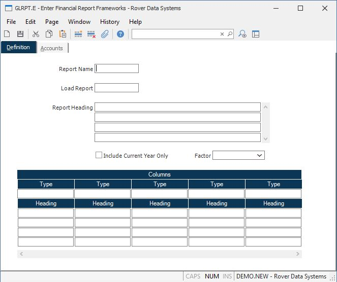

##  Enter Financial Report Frameworks (GLRPT.E)

<PageHeader />

##  Definition

**Report name** Enter a unique report name (no spaces).  
  
**Load report** If you are building a new report, you may enter the name of an
existing report structure. This will cause the existing report to be loaded
into the screen, allowing you to make any changes in it to create the desired
new report. This can best be used when creating a report which is similar to
another, avoiding the re-entry of the data required. If there are already line
items present in this record, the new items loaded from the report will be
added after the last line.  
  
**Heading** Enter the heading which will appear at the top of each page of the
report.  
  
**Print Account Numbers** If you wish to print the account number in the left
hand column of this report, check this box. Leaving the box unchecked will
suppress the printing of the account number on the report. This can be done to
save room on the report for an extra column of figures.  
  
**Include Current Transactions Only** Check this box if only the transactions
that occured within the current year are to be included in the report (e.g. do
not include the beginning balance for the year).  
  
**Factor** Enter the factor which will determine how amounts will be displayed on this financial report. If this field is left blank, the method selected in the [ gl.control ](../../GL-CONTROL/README.md) record will be used.   
  
**Col type** Enter the code which will define the value which will print in
each of the columns. One type code is entered for each column of amounts to
appear on the report.  
  
**Col headings** Enter the headings you wish have appear at the top of each
column of figures on the report.  
  
  
<badge text= "Version 8.10.57" vertical="middle" />

<PageFooter />