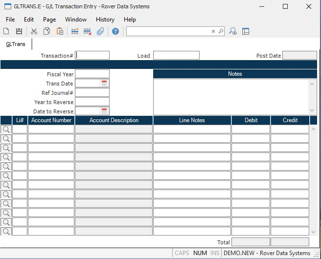

##  G/L Transaction Entry (GLTRANS.E)

<PageHeader />

##

**Gltrans ID** The number of the transaction (journal entry). For new transactions, this number will be automatically assigned when the record is filed. Existing numbers can be entered only if the transaction has not yet been posted (the post flag in the [ GL.CONTROL ](../../GL-CONTROL/README.md) record is set to 'H').   
  
**Load** If you wish to load in the account numbers from an existing journal,
enter the existing transaction number here. This function can only be used
with new records. This function is usually used when recording entries like
payroll. The account numbers used are the same but the amounts differ on each
entry.  
  
**Fiscal year** Enter the fiscal year into which this transaction is being posted. This may be any year which has previously been identified through the [ FY.E ](FY-E/README.md) procedure. However, if the fiscal year you enter has already been identified as "finally closed", then that fiscal year will not be acceptable. Once entered, each subsequent record will default the fiscal year automatically to the fiscal year previously entered. It can then be overridden if required.   
  
**Date** The date to which this transaction is being posted. It must fall
within the previously defined fiscal year. It must also NOT be in a previously
'finally' closed fiscal year. Once entered, each subsequent record will
default to the previously entered date. It can then be overridden if required.  
  
**Ref Journal #** This is a general use field. It is used, mainly, to sort the
transactions for a period on a report by journal number. This helps to
identify potential posting problems by grouping the journal entries.  
  
**Year to Reverse** If you want a reversing entry for this transaction to be created automatically, then enter the fiscal year in which the reversal is to posted. The year must have been previously defined with [ FY.E ](FY-E/README.md) .   
  
**Date to Reverse** If you want a reversing entry for this transaction to be
created automatically, then enter the date on which the reversal is to posted.  
  
**Desc** Enter any general notes required about this journal entry.  
  
**Line number** The line item number is a unique identifier used to define
each account and amount be posted in this journal entry.  
  
**Account number** Enter the account number to which the associated amount on
this line will be posted. The number must exist in the GLCHART file.  
  
**Acct desc** This is the account description loaded from the GLCHART file. It
is displayed here for verification only, and cannot be changed.  
  
**Line Notes** Enter any specific notes for the associated line.  
  
**Debit Amt** If the amount being applied to this account is a debit, enter
the amount here.  
  
**Credit Amt** If the amount being applied to this account number is a credit,
enter the amount here.  
  
**** If this journal entry was generated through the GL interface from
register records there may be additional details available about the source of
the entry. Click this button to view this information.  
  
**Total Debit** The total of all amounts in the debit column.  
  
**Credit Amt** The total of all amounts in the credit column.  
  
**Post Date** This field contains the date this record was posted. If there is
a date in this field, no changes to the record are permitted.  
  
  
<badge text= "Version 8.10.57" vertical="middle" />

<PageFooter />