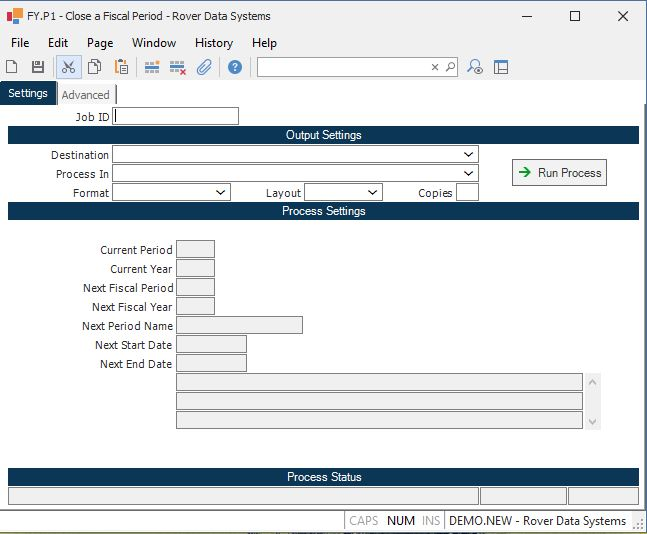

##  Close a Fiscal Period (FY.P1)

<PageHeader />

##

**Job ID** Enter a unique ID if you wish to enter and save the parameters to
this procedure for future use. If you only need to run the procedure and do
not want to save your entry then you may leave this field empty.  
  
**Destination** Select the destination for the output from this procedure.  
  
**Process** Select the method to be used for processing the report. Foreground
is always available and must be used when output is directed to anything other
than a system printer (i.e. printers spooled through the database on the host
computer.) Depending on your setup there may be various batch process queues
available in the list that allow you to submit the job for processing in the
background or at a predefined time such as overnight. A system printer must be
specified when using these queues.  
  
**Format** Select the format for the output. The availability of other formats
depends on what is allowed by each procedure. Possible formats include Text,
Excel, Word, PDF, HTML, Comma delimited and Tab delimited.  
  
**Layout** You may indicate the layout of the printed page by specifying the
appropriate setting in this field. Set the value to Portrait if the page is to
be oriented with the shorter dimension (usually 8.5 inches) at the top or
Landscape if the longer dimension (usually 11 inches) is to be at the top.
Portrait will always be available but Landscape is dependent on the output
destination and may not be available in all cases.  
  
**Copies** Enter the number of copies to be printed.  
  
**Run Process** Click on the button to run the process. This performs the save
function which may also be activated by clicking the save button in the tool
bar or pressing the F9 key or Ctrl+S.  
  
**Current period** This field contains the current fiscal period that is entered in [ GL.CONTROL ](../../../GL-ENTRY/GL-CONTROL/README.md) . This field cannot be changed in this procedure. If you wish to close a different year, update the year in [ GL.CONTROL ](../../../GL-ENTRY/GL-CONTROL/README.md) .   
  
**Current year** This field contains the current fiscal year that is entered in [ GL.CONTROL ](../../../GL-ENTRY/GL-CONTROL/README.md) . This field cannot be changed in this procedure. If you wish to close a different year, update the year in [ GL.CONTROL ](../../../GL-ENTRY/GL-CONTROL/README.md) .   
  
**Next fiscal period** The fiscal period which will become the new, current
period after this period end process is run. This is shown in order to make
sure you are certain this is what you want to do. This field cannot be changed
in this procedure.  
  
**Next fiscal year** The fiscal year which will become the new, current fiscal
year after this procedure is run. If this is not closing the final period of
the year, then this will match the current fiscal year. If it is closing the
year, then this will contain the next year. This field cannot be changed in
this procedure.  
  
**Next period name** The name of the next period, as defined in the FY file.
This will become the current period if the procedure is run.  
  
**Next start date** The start date of the next fiscal period as defined in the
FY file.  
  
**Next end date** The end date of the next fiscal period, as defined in the FY
file.  
  
**Year end message** This contains information about whether this procedure
will close the current year, as well as the current period. This happens when
the period you are about to close is also the last period of the year. This
will not stop you from posting future transactions against the closed year.  
  
**Last Status Message** Contains the last status message generated by the
program.  
  
**Last Status Date** The date on which the last status message was generated.  
  
**Last Status Time** The time at which the last status message was generated.  
  
  
<badge text= "Version 8.10.57" vertical="middle" />

<PageFooter />