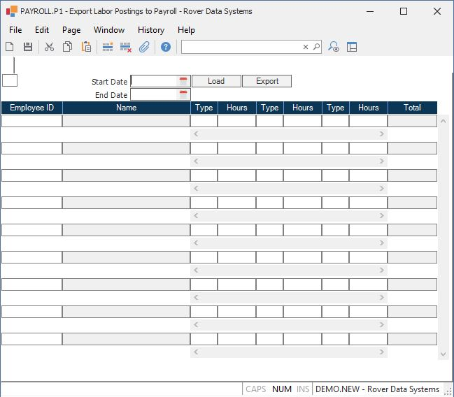

##  Export Labor Postings to Payroll (PAYROLL.P1)

<PageHeader />

##

**ID** This field is automatically skipped.  
  
**Start Date** Enter the start date for determining which labor postings are
to be included in the payroll export.  
  
**End Date** Enter the end date for determining which labor postings are to be
included in the payroll export.  
  
**Load** Click this button to populate the form with the labor data posted for
the period specified in the start and end date fields.  
  
**Employee ID** Displays all of the employees selected for export to payroll
for the period specified. Employees may be added or removed from this list.  
  
**Name** Displays the name of the associated employee.  
  
**Type** Displays each posting type for the hours accumulated during the period selected. These codes are defined in the [ LABOR.CONTROL ](../../../../../rover/AP-OVERVIEW/AP-ENTRY/AP-E/CHECKS-E/AP-CONTROL/GLCHART-E/GLCHART-E-1/GLCHART-R2/WO-CONTROL/WO-CONTROL-1/LABOR-CONTROL) procedure and typically contain entries such as "R" for regular, "O" for overtime, "D" for double time etc.   
  
**Hours** Displays the hours accumulated for each type.  
  
**Total** Displays the total of all the hours for the employee.  
  
**Export** Click this button to export the information displayed on the form.  
  
  
<badge text= "Version 8.10.57" vertical="middle" />

<PageFooter />