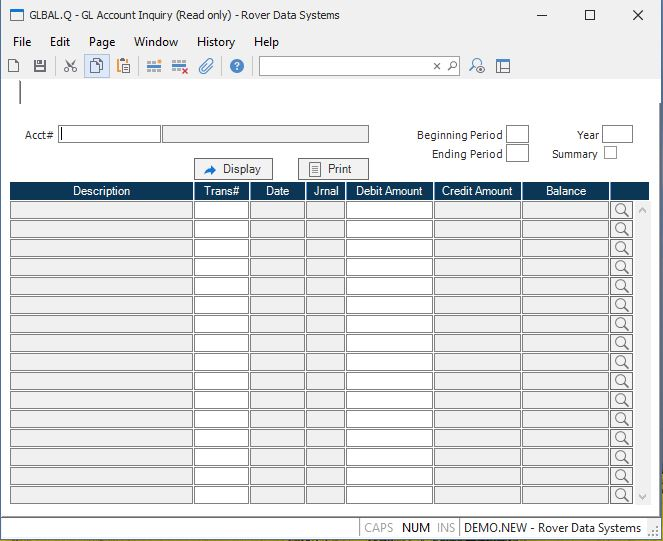

##  GL Account Inquiry (GLBAL.Q)

<PageHeader />

##

** **  
  
**Account Number** Enter the GLCHART account number.  
  
**Description** This field contains the account description, as read from the
GLCHART file.  
  
**Beginning period** Enter the beginning fiscal period for which you wish to
see information.  
  
**Ending Period** Enter the ending fiscal period for which you wish to see
information.  
  
**Fiscal Year** Enter the fiscal year for which you wish to see information.  
  
**Summary** Check this box to display a summary version of the data. In this
case, only one line per fiscal period will be displayed, showing the period
end balances.  
  
**Display** Press this button to display the data for the period(s)
designated.  
  
**Description** This field contains the description from the journal entry. If
the jurnal entry contains a line note, that will be shown here. If not, then
the header note will be displayed.  
  
**Trans#** This field contains the journal entry (GLTRANS) record number.  
  
**Date** This field contains the date of the journal entry.  
  
**Journal** Contains the reference journal number, as found in the GLTRANS
record.  
  
**Debit Amount** Contains the debit amount from the line item of the journal
entry.  
  
**Credit Amount** Contains the credit amount from the line of the journal
entry.  
  
**Detail** Press this button to see the detail register information, if any, related to this line of the journal entry. This information will only be available if the journal entry was created through the [ GLINT.P1 ](../../../../../rover/AP-OVERVIEW/AP-ENTRY/AP-E/CHECKS-E/AP-CONTROL/GLCHART-E/GLCHART-E-1/GL-CONTROL/GL-CONTROL-1/GLINT-P1) procedure from a detail register file.   
  
**Balance** This field contains the balance of the account at each month end.  
  
**Print** Press this button to print the data for the period(s) designated.  
  
  
<badge text= "Version 8.10.57" vertical="middle" />

<PageFooter />