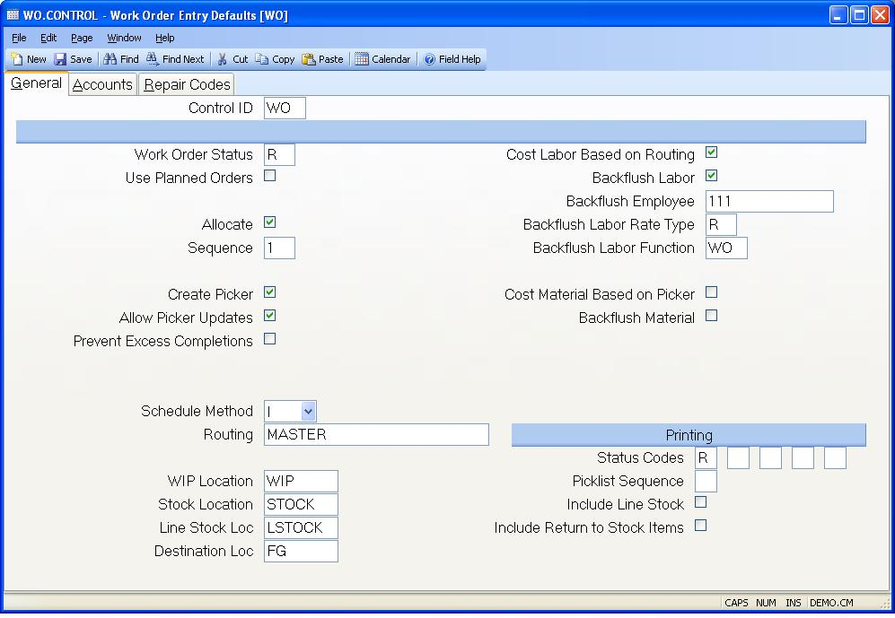

##  Work Order Entry Defaults (WO.CONTROL)

<PageHeader />

##  General

**Control ID** The ID to this record is "WO" and is automatically loaded by
the system.  
  
**Work Order Status** Enter one of the following status codes:  
N - New work order  
O - Open work order  
R - Release work order The code entered will be used as the default status
during work order entry.  
  
**Use Planned Orders?** Check this box if you want to create work orders from
planned orders. Planned order information will be presented for selection, and
if selected will cause work order information to be defaulted from the planned
order.  
  
**Allocate?** Check this box if the default entry for allocating components is
to be yes. Otherwise, leave this box unchecked.  
  
**Allocation Sequence** Enter one of the following numbers which defines the
method used for automatically allocating lots for components on the pick list:  
0\. Do not automatically assign lot numbers.  
1\. Use oldest lots first regardless of available quantity.  
2\. Use the lot that has the smallest available quantity that still meets the
quantity required. Unless you have parts that are lot controlled you should
always set this field to 0.  
  
**Create Picker?** Check this box if a picker record is normally created.  
  
**Allow Picker Updates** Check this box if updates to the part number and location fields are allowed in [ PICKER.E2 ](PICKER-E2/README.md) . If this box is not checked, you will need to use [ PICKER.E1 ](PICKER-E1/README.md) to make those changes.   
  
**Prevent Excess Completions** Check this box if a work order cannot be
completed for a quantity greater than what is was issued for. If this box is
checked and the status on the work order was manually changed to "C" (for
completed), you will not be able to make any additional completions against
the work order.  
  
**Field6** Enter one of the following three codes to define the default
schedule method to be used:  
F - Schedule order based on available capacity.  
I - Schedule based on routing only without checking available capacity.  
M - Manually schedule the order.  
  
**Routing** Enter the default routing to be loaded when there is no routing on
file for the part number on the order.  
  
**WIP Location** Enter the ID of the work in process location to be used.  
  
**Stock Location** Enter the location from which material is to be pulled.  
  
**Line Stock Location** Enter the location from which line stock will be
pulled.  
  
**Destination Location** Enter the default location to be used as the
destination location for work order entry.  
  
**Labor by Routing** If your inventory costing method is set to average or actual cost (see [ INV.CONTROL ](../../../../../../../../../../../rover/AP-OVERVIEW/AP-ENTRY/AP-E/AP-E-2/INV-CONTROL) ), you have the option of letting the system calculate the value of labor for the items built based on the hours in the work order routing instead of the actual hours posted through labor transactions. This option may be appropriate if you do not plan to post labor transactions or if you make partial completions from a work order. Variances between the actual labor posted and the routing labor will be posted when the work order is finalized.   
  
**Backflush Labor** If you do not post labor transactions to work orders, you
may have the system post labor automatically based on the routing by checking
this box. As items are completed labor transactions will be created based on
the hours specified in the work order routing.  
  
**Backflush Employee** Enter the employee number to be used on labor
transactions created when labor is backflushed.  
  
**Backflush Labor Rate Type** Enter the labor rate type code (defined in [ LABOR.CONTROL ](LABOR-CONTROL/README.md) ) to be used when labor transactions are created by the labor backflush process.   
  
**Backflush Labor Function** Enter the labor function to be used when labor
records are created for backflushed labor.  
  
**Material by Picker** If you check this box the value of material for items completed from the work order will be based on the value of the items in the picker. This only applies when the inventory costing method is average or actual (see [ INV.CONTROL ](../../../../../../../../../../../rover/AP-OVERVIEW/AP-ENTRY/AP-E/AP-E-2/INV-CONTROL) ). This can be useful in cases where all of the materials are not moved into the work order before completions are made. This avoids having earlier completions carrying a lower material value than later completions. It also prevents the presence of excess materials or deficits of material from affecting the value.   
  
**Backflush Material** Check this box if the default setting for new work
orders should be set to backflush.  
  
**Status Codes** Rather then print, or be asked the question to print the
various work order documents each  
time the work order is saved, it may be desirable to limit this to times when
the work order is in  
one or more specific states. You may do this by entering each of the status
codes at which  
you want this to occur. Possible entries are:  
N - New  
O - Open  
R - Released  
P - Pulled  
C - Closed  
F -  
  
**Picklist Sequence** Enter the letter "B" if the items on the pick list are
to be sorted in bin number sequence, "P" if the are to be sorted in the
default picklist sequence, or "R" if the sort should be done based on
reference bin location.  
  
**Include Line Stock** Check this box if line stock items are to be included
in the printed picking list.  
  
**Include Return to Stock Items** Check this box if line return to stock items
are to be included in the printed picking list.  
  
  
<badge text= "Version 8.10.57" vertical="middle" />

<PageFooter />