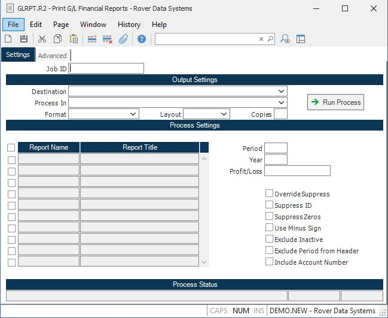

##  Print G/L Financial Reports (GLRPT.R2)

<PageHeader />

##

**Job ID** Enter a unique ID if you wish to enter and save the parameters to
this procedure for future use. If you only need to run the procedure and do
not want to save your entry then you may leave this field empty.  
  
**Destination** Select the destination for the output from this procedure.  
  
**Process** Select the method to be used for processing the report. Foreground
is always available and must be used when output is directed to anything other
than a system printer (i.e. printers spooled through the database on the host
computer.) Depending on your setup there may be various batch process queues
available in the list that allow you to submit the job for processing in the
background or at a predefined time such as overnight. A system printer must be
specified when using these queues.  
  
**Format** Select the format for the output. The availability of other formats
depends on what is allowed by each procedure. Possible formats include Text,
Excel, Word, PDF, HTML, Comma delimited and Tab delimited.  
  
**Layout** You may indicate the layout of the printed page by specifying the
appropriate setting in this field. Set the value to Portrait if the page is to
be oriented with the shorter dimension (usually 8.5 inches) at the top or
Landscape if the longer dimension (usually 11 inches) is to be at the top.
Portrait will always be available but Landscape is dependent on the output
destination and may not be available in all cases.  
  
**Copies** Enter the number of copies to be printed.  
  
**Run Process** Click on the button to run the process. This performs the save
function which may also be activated by clicking the save button in the tool
bar or pressing the F9 key or Ctrl+S.  
  
**Report names** Enter the report name(s) you wish to print. You may enter
multiple names, or simply enter the word "ALL" to list all reports.  
  
**Report.Period** The period for which you wish to run the report. This field
defaults to the period from the Control file record GL. This is a required
field.  
  
**Report.Year** The report year for which you wish to run the report. This
field defaults to the report year in the Control file record GL. This is a
required field.  
  
**Profit/Loss** Enter the profit or loss amount from the current income statement. This field will only be prompted when the financial report contains "PROFIT" in the account number field (see [ GLRPT.E ](../../../../../rover/GL-OVERVIEW/GL-ENTRY/GLRPT-E/README.md) ) This is useful when there is not a current profit or loss account number to use for the report.   
  
**Override Suppress** If you want to override the suppress option entered in the [ GLRPT.E ](../../../../../rover/GL-OVERVIEW/GL-ENTRY/GLRPT-E/README.md) procedure, check this box. This option is used primarily when you want to see each detail account printed for balancing purposes.   
  
**Suppress ID** This field allows you to suppress the printing of the report
name in the heading of the report.  
  
**Suppress Zeros** If you want the report to exclude lines for accounts that
have a zero balance then check this box.  
  
**Use Minus Sign** Check this box if you want a minus sign (-) to precede
negative amounts. Leave it unchecked to use brackets.  
  
**Exclude Inactive Accts** Check this box to exclude inactive account numbers
from being included in the report. Please note that if an account is flagged
as inactive, but carries a balance for the report period, then any report that
would have included that account may end up out of balance.  
  
**Last Status Message** Contains the last status message generated by the
program.  
  
**Last Status Date** The date on which the last status message was generated.  
  
**Last Status Time** The time at which the last status message was generated.  
  
**Exclude Period from Header** Check this box if you do not wish the selected
period to be included in the header of the report.  
  
  
<badge text= "Version 8.10.57" vertical="middle" />

<PageFooter />