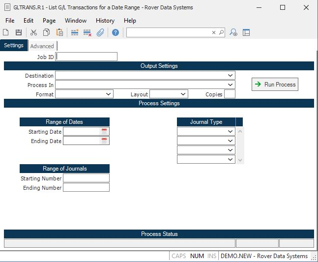

##  List G/L Transactions for a Date Range (GLTRANS.R1)

<PageHeader />

##

**Job ID** Enter a unique ID if you wish to enter and save the parameters to
this procedure for future use. If you only need to run the procedure and do
not want to save your entry then you may leave this field empty.  
  
**Destination** Select the destination for the output from this procedure.  
  
**Process** Select the method to be used for processing the report. Foreground
is always available and must be used when output is directed to anything other
than a system printer (i.e. printers spooled through the database on the host
computer.) Depending on your setup there may be various batch process queues
available in the list that allow you to submit the job for processing in the
background or at a predefined time such as overnight. A system printer must be
specified when using these queues.  
  
**Format** Select the format for the output. The availability of other formats
depends on what is allowed by each procedure. Possible formats include Text,
Excel, Word, PDF, HTML, Comma delimited and Tab delimited.  
  
**Layout** You may indicate the layout of the printed page by specifying the
appropriate setting in this field. Set the value to Portrait if the page is to
be oriented with the shorter dimension (usually 8.5 inches) at the top or
Landscape if the longer dimension (usually 11 inches) is to be at the top.
Portrait will always be available but Landscape is dependent on the output
destination and may not be available in all cases.  
  
**Copies** Enter the number of copies to be printed.  
  
**Run Process** Click on the button to run the process. This performs the save
function which may also be activated by clicking the save button in the tool
bar or pressing the F9 key or Ctrl+S.  
  
**Start Date** Enter the starting transaction date you wish to appear on this
report (i.e. the first of a range of dates). Leave this field null to list all
journal transactions from the beginning.  
  
**End Date** Enter the ending transaction date you wish to appear on this
report (i.e. the ending date of a range). If you leave this field null, all
transactions from the start date will be printed.  
  
**Last Status Message** Contains the last status message generated by the
program.  
  
**Last Status Date** The date on which the last status message was generated.  
  
**Last Status Time** The time at which the last status message was generated.  
  
**Starting Number** If you wish to run this report for a range of journal
entries, enter the starting number in this field.  
  
**Ending Number** If you wish to run this report for a range of journal
entries, enter the ending number in this field.  
  
**Journal Type** If you wish to run this report for a specific types of
journals, enter the types in this field. The valid entries are:  
  
1\. Gltrans - Journal entries created in [ GLTRANS.E ](../../../GL-ENTRY/GLTRANS-E/README.md) .   
2\. Recon - Journal entries created via [ RECON.E ](../../../../AR-OVERVIEW/AR-ENTRY/RECON-E/README.md) .   
2\. Recurring = Recurring journal entries created via [ GLRECUR.P1 ](../../../GL-PROCESS/GLRECUR-P1/README.md) .   
3\. Register - Journal entries created from one of the four reigster files (APREG, ARREG, INVREG and WOREG) via the [ GLINT.P1 ](../../../GL-PROCESS/GLINT-P1/README.md) procedure.   
  
Leave this field blank to include all journals.  
  
  
<badge text= "Version 8.10.57" vertical="middle" />

<PageFooter />