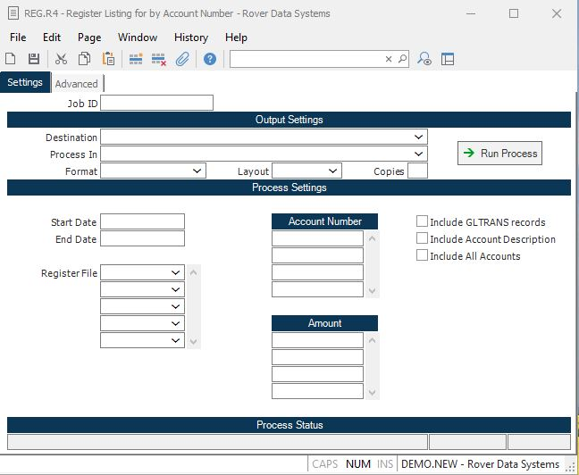

##  Register Listing for by Account Number (REG.R4)

<PageHeader />

##

**Job ID** Enter a unique ID if you wish to enter and save the parameters to
this procedure for future use. If you only need to run the procedure and do
not want to save your entry then you may leave this field empty.  
  
**Destination** Select the destination for the output from this procedure.  
  
**Process** Select the method to be used for processing the report. Foreground
is always available and must be used when output is directed to anything other
than a system printer (i.e. printers spooled through the database on the host
computer.) Depending on your setup there may be various batch process queues
available in the list that allow you to submit the job for processing in the
background or at a predefined time such as overnight. A system printer must be
specified when using these queues.  
  
**Format** Select the format for the output. The availability of other formats
depends on what is allowed by each procedure. Possible formats include Text,
Excel, Word, PDF, HTML, Comma delimited and Tab delimited.  
  
**Layout** You may indicate the layout of the printed page by specifying the
appropriate setting in this field. Set the value to Portrait if the page is to
be oriented with the shorter dimension (usually 8.5 inches) at the top or
Landscape if the longer dimension (usually 11 inches) is to be at the top.
Portrait will always be available but Landscape is dependent on the output
destination and may not be available in all cases.  
  
**Copies** Enter the number of copies to be printed.  
  
**Run Process** Click on the button to run the process. This performs the save
function which may also be activated by clicking the save button in the tool
bar or pressing the F9 key or Ctrl+S.  
  
**Last Status Message** Contains the last status message generated by the
program.  
  
**Last Status Date** The date on which the last status message was generated.  
  
**Last Status Time** The time at which the last status message was generated.  
  
**Start Date** If you wish to run this report for a specific time frame, enter
the starting date in this field.  
  
**End Date** If you wish to run this report for a specific time frame, enter
the ending date in this field.  
  
**Register File** If you wish to run this report for specific register files
or modules, enter the file names in this field. If this field is left blank,
the report will be run for all register files  
  
**Account Number** If you wish to limit this report to specific g/l account
numbers, enter the account numbers in this field.  
  
**Include GLTRANS records** Check this box if you wish to include transactions that were made for manual journal entries via [ GLTRANS.E ](../../../GL-ENTRY/GLTRANS-E/README.md) or the g/l recurring process and not from the interface procedure.   
  
**Include Account Description** Check this box if you wish to include
description for the g/l account number on the report.  
  
**Exclude Totals** Check this option if you do not wish to include the totals
on the report. This option would most likely be selected when exporting the
data to Excel or a text file.  
  
**Include All Accounts** Select this option if you wish print the report for
all account numbers that had transactions made against them in the selected
time period.  
  
  
<badge text= "Version 8.10.57" vertical="middle" />

<PageFooter />