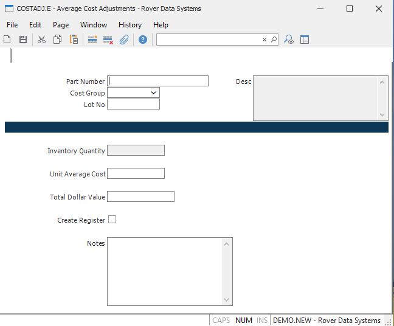

##  Average Cost Adjustments (COSTADJ.E)

<PageHeader />

##

**ID** The record ID for the COSTADJ item is assigned by the system when the
record is filed. It is not displayed for entry.  
  
**Part Number** Enter the number of the part whose average cost is to be
changed.  
  
**Cost Group** Enter the cost group which will be validated against [ INV.CONTROL ](../../INV-CONTROL/README.md) . The cost group is used to define the costing method and to group inventory locations together for averaging the cost within those locations.   
  
**Lot No** If lot costing is active and the part number you have selected is
lot control then enter the lot number to be adjusted.  
  
**Inventory Quantity** This field contains the total quantity in all inventory
locations for the part number entered. It is displayed for information only
and may not be changed.  
  
**Unit Average Cost** This field contains the current unit average cost for
the part number and cost group. If you change the unit cost then the Total
Dollar Value field will be changed to show the total dollar value which will
result from the making the change.  
  
**Total Dollar Value** The total dollar value is calculated by multiplying the
unit average cost by the total quantity. If you change the contents of this
field then the unit average will be recalculated by dividing this number by
the total quantity.  
  
**Create Register** Check this box if you want the system to create inventory
register records to post the accounting impact of the adjustment. An example
of a situation in which you would not want registers created would be where
you have received materials from a vendor and end up changing the price in the
accounts payable system because it was wrong on the original purchase order.
In this case the accounting impact of the change is already posted on the
account payable register and would be redundant if posted in the adjustment of
the unit cost maintained within inventory.  
  
**Notes** If appropriate you may enter notes to provide information about the
reason for the change in average cost.  
  
**Desc** The description of the part number entered is displayed in this
field. It may not be changed.  
  
  
<badge text= "Version 8.10.57" vertical="middle" />

<PageFooter />