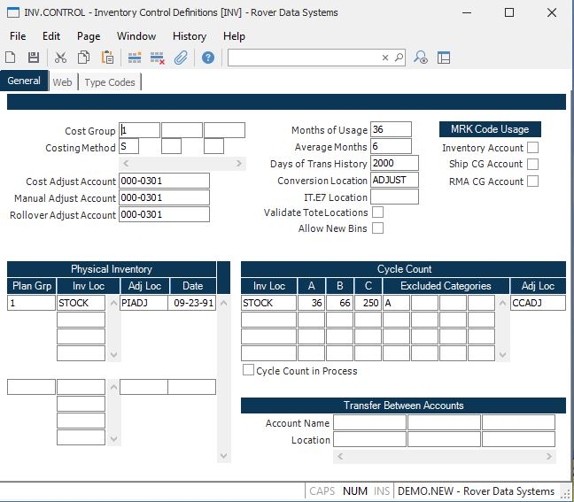

##  Inventory Control Definitions (INV.CONTROL)

<PageHeader />

##

**Control ID** The record ID for the INV.CONTROL record is "INV". It is loaded
automatically by the system, and is the only record accessible by this
procedure.  
  
**Cost Group** Enter the cost groups that will be used for grouping inventory
locations and collecting costs using the associated method. A cost group will
be required for each inventory location.  
  
**Cost Method** Enter one of the following letter codes which defines the
costing method to be used for the associated cost group...  
A - Average Cost  
S - Standard Cost  
L - Lot Cost  
If no entry is made then Standard Cost is assumed. If lot costing is selected
then lot cost will be used for all lot controlled parts and average cost will
be used for non-lot controlled parts.  
  
**Cost Adjust Account** If you are using average costing, enter the general
ledger account number to be used for writing-off variances created as part of
the inventory averaging process. This account must be entered for average
costing to function properly.  
  
If you are using standard cost, then this account may be used if a part is
moving from one cost group to another and those 2 cost groups carry a
different cost for the part. This account will be used to capture the
difference. This account may also be used when reversing work order
completions at a different cost than the one the work order was completed at.  
  
**Manual Adjust Account** Enter the general ledger account number to be used as the offset account for manual average cost adjustments entered in the [ COSTADJ.E ](../../COSTADJ-E/README.md) procedure.   
  
**Rollover Adjust Account** Enter the general ledger account number to be used as the offset account for cost adjustments made by the cost rollover procedure ( [ COST.P2 ](../../../../ENG-OVERVIEW/ENG-PROCESS/COST-P2/README.md) ) or the cost rollup procedure ( [ COST.P1 ](../../../../ENG-OVERVIEW/ENG-PROCESS/COST-P1/README.md) ).   
  
**Trans History Days** Enter the number of days of history to be kept on the Inventory file for viewing on [ INV.Q ](../../../INV-REPORT/INV-Q/README.md) . All history will still be maintained on the Inventory Transaction file and can still be viewed via the IT.R series reports. Please note that [ INV.P2 ](../../../INV-PROCESS/INV-P2/README.md) will need to be run after making a change in this field.   
  
**Conversion Location** Enter an adjustment location to be used in [ IT.E4 ](../../IT-E4/README.md) for inventory conversion. This will be a pass-through location for the parts being consumed and the parts being created to be moved into and out of.   
  
**Months of Usage** Enter the number of months of usage to maintain in the Usage file. During the [ USAGE.P1 ](../../../INV-PROCESS/USAGE-P1/README.md) process, all months in excess of this number will be dropped. If this field is left blank, 12 months are maintained.   
  
**Average Months** This field defines the number of months of usage to be used
in calculating the average monthly usage used in various areas of the system.
For example, if you are keeping usage history for 12 months, but want your
average to be based on only the last 6 months, then enter 6.  
  
**Plan Group** Enter the plan group that will control the associated physical
inventory settings.  
  
**Inventory locations** Enter the inventory location(s) that are to be
included in the physical inventory for the assoociated plan group.  
  
**Physical adjust location** Enter the INVLOC to be used by the Physical
Inventory process for quantity adjustments.  
  
**Physical Date** This is the date a physical inventory was started by executing the [ PHYS.P1 ](../../../INV-PROCESS/PHYS-P1/README.md) process. Removal of this date means that you are cancelling a physical after tags have been generated. Make sure this is really what you want to do. When the tag posting process runs, this date will be removed automatically.   
  
**Invloc** Enter the inventory locations which are to have parts stratified.  
  
**A** The frequency, in number of working days, that each "A" part will be
cycle counted.  
  
**B** The frequency, in number of working days, that each "B" part will be
cycle counted.  
  
**C** The frequency, in number of working days, that each "C" part will be
cycle counted.  
  
**Excluded Categories** Enter any part categories which are not to be included
in a cycle count for this location.  
  
**Adjust Loc** Enter the INVLOC to be used by the Cycle count process for
quantity adjustments.  
  
**Cycle Count in Process** If [ CYCLE.P1 ](../../../INV-PROCESS/CYCLE-P1/README.md) is currently being run this box will be checked. After completion this will be blank. If the process is aborted, then this field will need to be cleared before rerunning. This is to prevent [ CYCLE.P1 ](../../../INV-PROCESS/CYCLE-P1/README.md) from being run concurrently.   
  
**Account Name** Enter the name of the account that will be sending inventory
to or receiving inventory from the current account.  
  
**Transfer Location** Enter the non-physical inventory location for the
current account that will accumulate the inventory dollars for parts sent to
or received from the associated account name entered previously.  
  
  
<badge text= "Version 8.10.57" vertical="middle" />

<PageFooter />