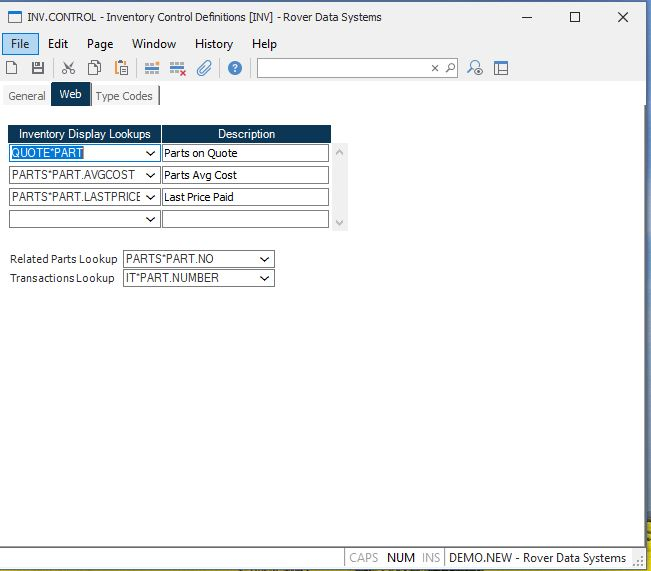

## Inventory Control Definitions (INV.CONTROL)

<PageHeader />

##

**Inventory Display Lookups** Add lookup tables to the Rover Web Inventory Parts module. Use `Description` to define the name of the tab.

[Integrations](../../../../business-suite/integrations/inventory/README.md#inventory-display-lookups)

<badge text= "Version 9.3.161" vertical="middle" />

<PageFooter />
