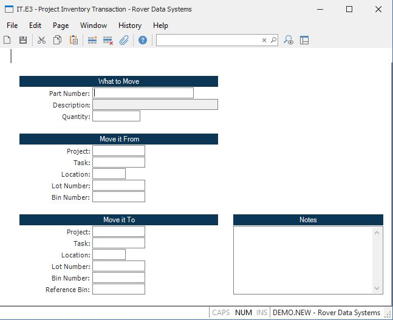

##  Project Inventory Transaction (IT.E3)

<PageHeader />

##

**Transaction ID** The transaction ID is assigned by the system and does not
appear on the screen as a prompt. The ID is a sequentially assigned number.  
  
**Part Number** Enter the part number of the item you are moving.  
  
**Description** Contains the first line of the description from the PARTS file
for the associated part number. The field is for reference only and may not be
changed.  
  
**Quantity** Enter the number of items being moved.  
  
**From Project** Enter the project from which the item is being moved. Leave
project and task blank if material is not being moved out of a project.  
  
**From Task** Enter the task ID associated with the project for this inventory
transaction. A lookup is provided to show all the tasks for the project.  
  
**Location** Enter the location that the material is being moved from.  
  
**From Lot** Enter the lot number associated with the material you are moving
if the item is lot controlled. If you are moving items from a non-physical
location then you may leave this field blank.  
  
**From Bin** Enter the bin from which the part is being moved. This field is
only prompted if the inventory location is bin controlled.  
  
**To Project** Enter the project into which this item is being moved.  
  
**To Task** Enter the task ID associated with the project for this inventory
transaction. A lookup is provided to show all the tasks for the project.  
  
**Location** Enter the location that the material is being moved to.  
  
**To Lot** This field will be defaulted to the same lot number as the from
lot. If you are splitting a lot you may enter the number of the new lot in
this field. You may also enter an existing lot provided it carries the same
part number. If you leave this field blank it is assumed that you want the
system to assign a new lot number.  
  
**To Bin** Enter the bin to which the part is being moved. This field is only
prompted if the inventory location is bin controlled.  
  
**Ref Bin** If you maintain the a reference bin location for inventory items
you may enter the bin location the parts were moved into.  
  
**Notes**  
  
  
<badge text= "Version 8.10.57" vertical="middle" />

<PageFooter />