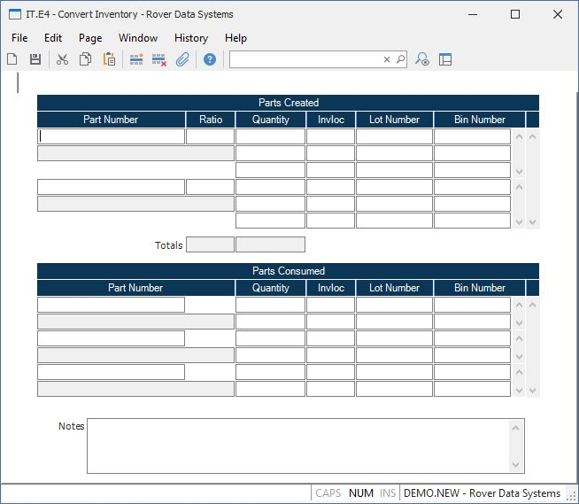

##  Convert Inventory (IT.E4)

<PageHeader />

##

**Transaction ID** The inventory transaction number is assigned by system and
does not appear as a prompt on the screen.  
  
**Part Number** Enter the part number of the item being created and moved to
inventory.  
  
**Description** Contains the first line of the description from the PARTS file
for the associated part number. The field is for reference only and may not be
changed.  
  
**Ratio** Enter the ratio for the associated part number. The ratio indicates
the percentage of the cost from the parts consumed that should be applied to
this item when re-averaging the cost of the part. This field will only be used
when using average cost.  
  
**To Quantity** Enter the quantity of the part being created.  
  
**To Invloc** Enter the location that the material is being moved to.  
  
**To Lot** If the part number entered is lot controlled then enter the lot
number the parts are being moved to. If you leave this field blank it is
assumed that you want the system to assign a new lot number.  
  
**To Bin** Enter the bin to which the material is being moved. This field is
only prompted when the INVLOC record is set to bin control.  
  
**Total Ratio**  
  
**Total Qty**  
  
**From Part Number** Enter the part number of the item you are removing from
inventory to create the new part number.  
  
**From Part Desc** Contains the first line of the description from the PARTS
file for the associated part number. The field is for reference only and may
not be changed.  
  
**From Quantity** Enter the quantity of the part being consumed.  
  
**From Invloc** Enter the location that the material is being consumed from.  
  
**From Lot** If the part number consumed is lot controlled then enter the
number of the lot being consumed/moved. You may leave this field blank if you
are moving items from a non-physical location.  
  
**From Bin** Enter the bin from which the material is being moved. This field
is only prompted when the INVLOC record is set to bin control.  
  
**Notes** Enter any notes in this field that apply to this transaction. These
notes will be posted to all inventory transaction (i.e. IT) records that are
created.  
  
  
<badge text= "Version 8.10.57" vertical="middle" />

<PageFooter />