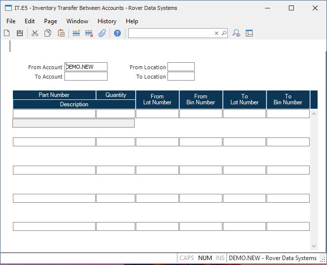

##  Inventory Transfer Between Accounts (IT.E5)

<PageHeader />

##

**Transaction ID** The inventory transaction number is assigned by system and
does not appear as a prompt on the screen.  
  
**From Account**  
  
**To Account**  
  
**From Loc**  
  
**To Loc**  
  
**Part Number** Enter the part number of the item you are moving.  
  
**Quantity** Enter the number of items being moved.  
  
**From Lot** If the part number entered is lot controlled then enter the
number of the lot being moved.  
  
**From Bin** Enter the bin from which the material is being moved. This field
is only prompted when the INVLOC record being moved from is set to bin
control.  
  
**To Lot** If the part number entered is lot controlled then enter the lot
number the parts are being moved to. This entry will be defaulted to the same
number entered in the from lot field. You may change it to another lot number
if you are splitting the lot or consolidating items from one lot into another.
If you leave this field blank it is assumed that you want the system to assign
a new lot number.  
  
**To Bin** Enter the bin to which the material is being moved. This field is
only prompted when the INVLOC record is set to bin control.  
  
**Description** Contains the first line of the description from the PARTS file
for the associated part number. The field is for reference only and may not be
changed.  
  
  
<badge text= "Version 8.10.57" vertical="middle" />

<PageFooter />