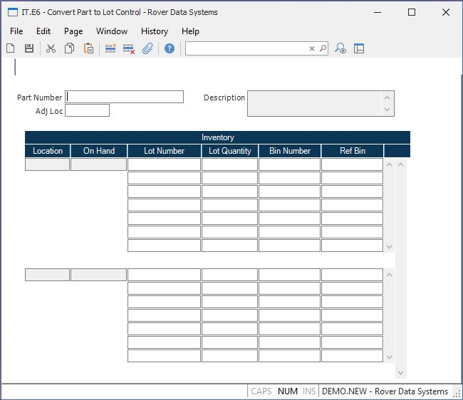

##  Convert Part to Lot Control (IT.E6)

<PageHeader />

##

**PART.NO**  
  
**Wrap Desc** The part description for information only.  
  
**Location** This is an existing inventory location and cannot be changed.  
  
**On Hand** This is the total quantity currently on hand for the existing
inventory location and cannot be changed.  
  
**Lot Qty** Enter the quantity associated with this lot. The system will
default this from the location qty.  
  
**Lot Number** Enter a lot number or leave blank to have the system generate a
new lot number.  
  
**Bin Number** Enter a bin number only if this location is bin controlled. It
will be stored on the lot record.  
  
**Ref Bin** Enter a reference bin if desired for this lot number and location.
It will be stored on the lot record.  
  
**Adj Loc** This is the adjustment location that will be used for the inventory transactions. This is just a pass-through location. It will be defaulted from the [ INV.CONTROL ](../../../../../rover/AP-OVERVIEW/AP-ENTRY/AP-E/AP-E-2/INV-CONTROL) "Conversion Location" entry, but can be changed.   
  
  
<badge text= "Version 8.10.57" vertical="middle" />

<PageFooter />