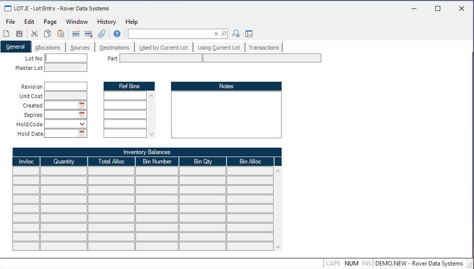

##  Lot Entry (LOT.E)

<PageHeader />

##  General

**Lot.Number** Enter the number of the lot to be entered or updated. If you
leave the field blank the system will assign the next sequential lot number
when the record is filed.  
  
**Part.Number** The number of the part that is identified by the lot record.
This number must be defined on the parts master file.  
  
**Revision** This field identifies the revision level of the items associated
with the lot number. It is loaded automatically when the lot is created as the
result of a purchase receipt or work order completion. It may be changed here
as required.  
  
**Unit.Cost** The unit cost associated with the parts defined by the lot. If lot costing is being used then this is the cost used in processing inventory transactions. When the lot is created by the system the cost is derived by averaging the costs of all incoming transactions, such as purchase order receipts and work order completions. If you are defining a new lot then you may enter the cost in this field. The cost of an existing lot may be changed with the [ COSTADJ.E ](../../COSTADJ-E/README.md) procedure.   
  
**Date Created** Contains the date on which the lot record was created.  
  
**Exp Date** The date on which the items defined by this lot have expired and may no longer be used. This date is set automatically by the system if a shelf life has been defined in the [ PARTS.E ](../../../../ENG-OVERVIEW/ENG-ENTRY/PARTS-E/README.md) procedure. It may be changed in this procedure if required. If you are defining a new lot and you leave this field blank then an expiration date will be calculated and placed into this field based on the shelf life defined in the PARTS file.   
  
**Hold Code** The lot may be placed on hold by enter a code in this field.
When a code is entered the current date will be defaulted as the hold date.  
  
**Hold Date** The hold date is automatically set to the current date when a
hold code is entered. It may be changed if desired.  
  
**Bin.Loc** Contains the bin locations at which the items in the lot may be stored. This field is set automatically based on entries made in [ IT.E ](../../IT-E/README.md) , and may be changed in this procedure.   
  
**Notes** This field allows you to maintain notes regarding the lot record.  
  
**Desc** Contains the first line of the part description as defined in the
Parts Master.  
  
**Invloc** Contains the list of all inventory locations that have a balance
on-hand of the items defined by the lot.  
  
**Quantity** Contains the total on hand quantity for this lot at the
associated location.  
  
**Total Alloc** This field contains the total quantity allocated for this lot.  
  
**Bin** This field contains a list of the bins which contain a quantity for
this lot. This is only used for bin controlled locations.  
  
**Bin Qty** The total quantity for this lot, in the associated bin number.  
  
**Total Allocated** The total quantity allocated, for the associated bin.  
  
  
<badge text= "Version 8.10.57" vertical="middle" />

<PageFooter />