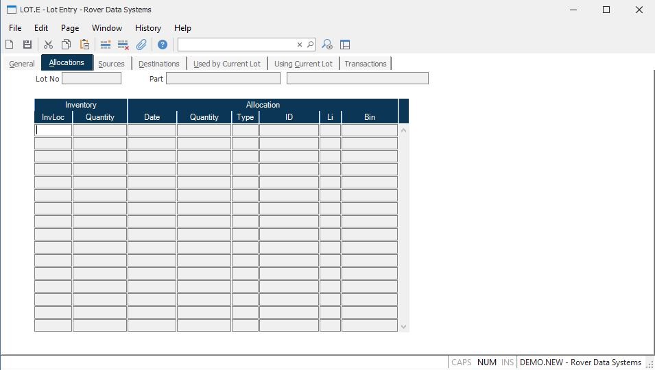

##  Lot Entry (LOT.E)

<PageHeader />

##  Allocations

**Inv Loc** Contains the list of all inventory locations that have a balance
on-hand of the items defined by the lot.  
  
**Inv Qty** Contains the quantity of items currently on-hand at the associated
inventory location.  
  
**Alloc Date** This field contains the dates on which the items in the lot are
allocated. This information may not be changed by this procedure.  
  
**Alloc Qty** Contains the number of lot items allocated on the associated
date.  
  
**Alloc Type** Identifies the type of document against which the allocation
has been made. "WO" for work order, "SH" for shipment etc.  
  
**Alloc ID** The ID of the document the has allocated the associated quantity.  
  
**Alloc Li** The line item number, if any, on the associated document that has
allocated the items in the lot.  
  
**Alloc.Bin** The bin number against which the inventory has been allocated
for this lot number.  
  
**Lot Number** The lot number currently being displayed.  
  
**Part Number** The part number associated with the lot number.  
  
**Description** The description of the part.  
  
  
<badge text= "Version 8.10.57" vertical="middle" />

<PageFooter />