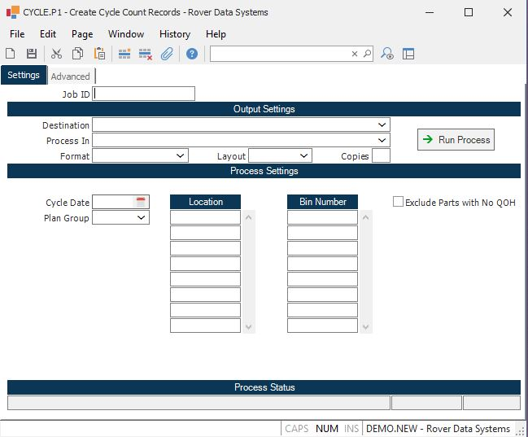

##  Create Cycle Count Records (CYCLE.P1)

<PageHeader />

##

**Job ID** Enter a unique ID if you wish to enter and save the parameters to
this procedure for future use. If you only need to run the procedure and do
not want to save your entry then you may leave this field empty.  
  
**Destination** Select the destination for the output from this procedure.  
  
**Process** Select the method to be used for processing the report. Foreground
is always available and must be used when output is directed to anything other
than a system printer (i.e. printers spooled through the database on the host
computer.) Depending on your setup there may be various batch process queues
available in the list that allow you to submit the job for processing in the
background or at a predefined time such as overnight. A system printer must be
specified when using these queues.  
  
**Format** Select the format for the output. The availability of other formats
depends on what is allowed by each procedure. Possible formats include Text,
Excel, Word, PDF, HTML, Comma delimited and Tab delimited.  
  
**Layout** You may indicate the layout of the printed page by specifying the
appropriate setting in this field. Set the value to Portrait if the page is to
be oriented with the shorter dimension (usually 8.5 inches) at the top or
Landscape if the longer dimension (usually 11 inches) is to be at the top.
Portrait will always be available but Landscape is dependent on the output
destination and may not be available in all cases.  
  
**Copies** Enter the number of copies to be printed.  
  
**Run Process** Click on the button to run the process. This performs the save
function which may also be activated by clicking the save button in the tool
bar or pressing the F9 key or Ctrl+S.  
  
**Cycle Date** Enter the date for which you wish to create cycle tag records. All inventory records with a cycle date less than or equal to the date entered will be selected. The cycle date was initially assigned to the inventory record when the [ INV.P1 ](INV-P1/README.md) procedure was run.   
  
**Plan Group** Enter the plan group for which you want to generate cycle
tickets. Leave blank to generate  
cycle tickets for all plan groups.  
  
**Last Status Message** Contains the last status message generated by the
program.  
  
**Last Status Date** The date on which the last status message was generated.  
  
**Last Status Time** The time at which the last status message was generated.  
  
**Location** If you only wish to create cycle tags for specific inventory locations, enter those inventory locations in this field. The location must be defined in [ INV.CONTROL ](../../../../../../../../../rover/AP-OVERVIEW/AP-ENTRY/AP-E/AP-E-2/INV-CONTROL) as a cycle count location.   
  
**Bin Number** If you only wish to create cycle tags for certain bin
numbers/locations, enter those bin numbers in this field. Please note that
this option will only be used for bin controlled locations. If you use
reference bins as opposed to bin controlled locations, this option will be
ignored.  
  
**Exclude Parts with No Qty on Hand** Check this box if you wish to exclude
parts that show no on hand quantity in the location being counted.  
  
  
<badge text= "Version 8.10.57" vertical="middle" />

<PageFooter />