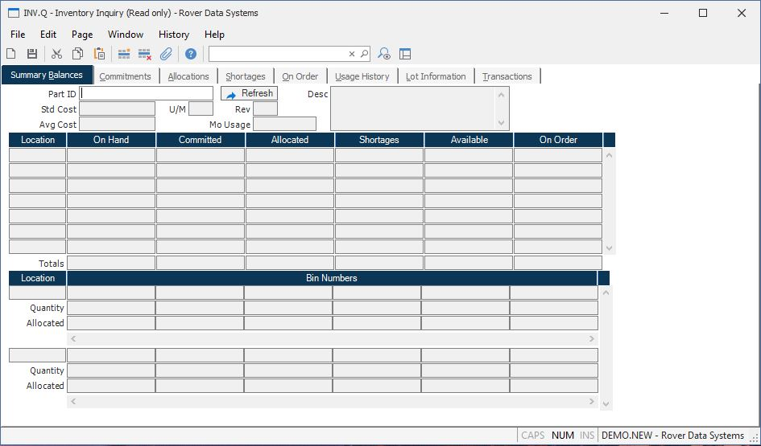

##  Inventory Inquiry (INV.Q)

<PageHeader />

##  Summary Balances

**Part ID** Enter the part number which identifies the inventory you want to
display. If you do not know the part number you may enter a model number,
manufacturer part number or a category.  
  
**Std Cost** Contains the current standard cost for the part number being
displayed. This will be the standard cost associated with the first cost group
using a standard costing method, otherwise it will be the first standard cost
if any associated with the part number.  
  
**Avg Cost** Contains the current average cost for the part number being displayed. This is the average across all cost groups for which this part has on-hand quantity. If there is zero on-hand, then this will be the cost associated with the first cost group defined in [ INV.CONTROL ](../../../INV-ENTRY/INV-CONTROL/README.md) . If this part has never existed in the first cost group, and there is zero on-hand, then this average cost will be zero.   
  
**Mo Usage** Displays the average monthly usage for the part.  
  
**Desc** Contains the description of the part number selected.  
  
**Location** Contains the inventory location associated with the quantity
information displayed.  
  
**On Hand** Contains the on hand quantity in the associated location for the
part number.  
  
**Commited** Contains the quantity of the part commited at the associated
location. Commitments can come from one of three sources.  
1\. Sales Orders which have the commit flag in [ SO.E ](../../../../MRK-OVERVIEW/MRK-ENTRY/SO-E/README.md) set for this item. Please note that only the part sold is committed and not the lower level components of an assembly. However, if the part sold is a phantom assembly, the components on the bill of material will show as committed.   
2\. Point of sale (retail) orders which have open quantities, such as layaway.  
3\. Work Orders which have been set up to backflush material will be committed
once their status is set to "P" (pulled).  
  
**Allocated** Contains the quantity of parts allocated at each location.
Allocations can come from one of two sources:  
1\. Pending shipments if the "allocate shipments" box in [ MRK.CONTROL ](../../../../MRK-OVERVIEW/MRK-ENTRY/MRK-CONTROL/README.md) has been set to "Y". If the part to be shipped is a phantom assembly the components will be loaded into the shipper and allocated. In all other cases only the item to be shipped is allocated. Pending shipments are shipments with a status of "N" (new).   
2\. Work Orders which are in an "R" (release) status. If the "allocate?" option box is set to "Y" in [ WO.E ](../../../../PRO-OVERVIEW/PRO-ENTRY/WO-E/README.md) , components listed on the picker are allocated when the work order is released. Please note that if the component on the picker is an assembly, the components used on that sub-assembly will not show as allocations against this work order.   
  
**Shortages** Contains the quantity of the part number which is short for the
associated location.  
Shortages are created two ways:  
1\. When a component part on a work order is pulled short (i.e. using [ PICKER.E2 ](../../../../PRO-OVERVIEW/PRO-ENTRY/PICKER-E2/README.md) ). When a work order is created in a "R" (released) status, the component material is allocated against the work order. Once the work order is pulled, the allocations are deleted since the material has now been pulled into the work order, or is due to be backflushed at a later time. However, if any of the material is pulled short, a shortage will be tracked against the part number for that work order. If the shortage is for an assembly, only the assembly will show as short not the components used on that assembly. If you are using MRP, requirements may be calculated for the components as a result of the assembly shortage.   
2\. Shortages can also be manually created via [ SHORTS.E ](../../../INV-ENTRY/SHORTS-E/README.md) . This may occur when parts are lost or damaged.   
  
**Available** Contains the number of parts that are not committed and/or
allocated. This figure represents the on-hand balance minus the greater of
allocations or commitments. Please note that the allocated quantity can be a
subset of the committed quantity. For example, you may have placed an order
for 10 pieces of a part and selected to commit that quantity. At this point,
10 pieces will show in the committed column. If you then create a shipper in a
"N" (new) status for the sales order for those same 10 pieces, you will see 10
pieces in the alllocated column. The available calculation will only be
reduced the quantity on hand by 10 pieces.  
  
**On Order** Contains the quantity of the part number which is on order for
the associated location. The order quantity comes from purchase orders and
work orders. When sending parts to vendors for outside processing, it is
possible to create a work order and purchase order for the same quantity. The
On Order tab will display both the purchase order and work oirder. However,
the quantity in this field, will only include the quantity from the work
order.  
  
**Location** Displays the location for the associated bins.  
  
**Bin Number** This field contains the list of bin numbers which are present
in the associated inventory location.  
  
**Bin Quantity** This field contains the number of units which are present in
the associated bin.  
  
**Bin Allocated Quantity** This field contains the number of units allocated
in the associated bin.  
  
**U/M** This is the stocking unit of measure from the parts master.  
  
**Tot On Hand** Contains the total on hand quantity for all locations for the
part number.  
  
**Total Commited** Contains the total committed quantity for all locations for
the part number.  
  
**Total Allocated** Contains the total allocated quantity for all locations
for the part number.  
  
**Total Shortages** Contains the total shortage quantity for all locations for
the part number.  
  
**Total Available** Contains the total available quantity for all locations
for the part number.  
  
**Total On Order** Contains the total on order quantity for all locations for
the part number.  
  
**Refresh** Click this button to refresh the information displayed to the most
current available.  
  
  
<badge text= "Version 8.10.57" vertical="middle" />

<PageFooter />