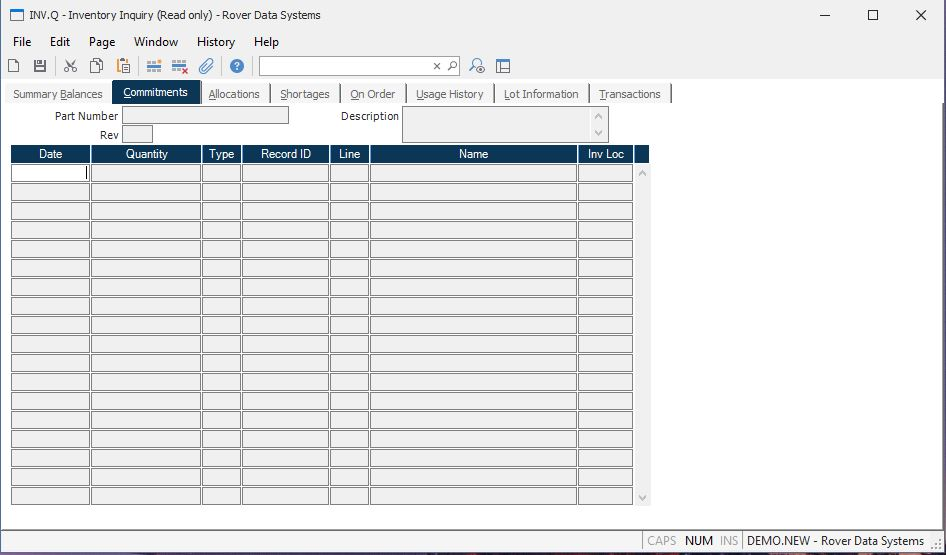

##  Inventory Inquiry (INV.Q)

<PageHeader />

##  Commitments

**Date** The date for which there is a commitment of this part. For sales
orders, this is the scheduled ship date.  
  
**Qty** The quantity of this part which is committed for the associated date.  
  
**Type** The type of order to which this part is committed.  
  
**ID** The order number which committed this inventory.  
  
**Li** The line item number on the order which contains this part number.  
  
**Name** The customer name for which the inventory is committed.  
  
**Invloc** The inventory location against which the inventory commitment was
made.  
  
**Part Number** The part number for which you are seeing the commitments.  
  
**Description** Contains the description of the part number selected.  
  
  
<badge text= "Version 8.10.57" vertical="middle" />

<PageFooter />