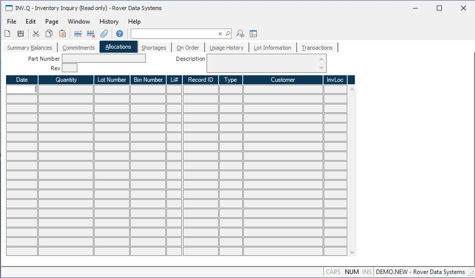

##  Inventory Inquiry (INV.Q)

<PageHeader />

##  Allocations

**Date** The date for which there is an allocation of this part. For
shipments, this is the scheduled ship date.  
  
**Qty** The quantity of this part which is allocated for the associated date.  
  
**Lot ID** Displays the lot number associated with the allocation.  
  
**Bin Number** Displays the bin number associated with the allocation.  
  
**Type** The type of order to which this part is allocated.  
  
**ID** The order number which allocated this inventory.  
  
**Li** The line item number on the order which contains this part number.  
  
**Name** The customer name for which the inventory is allocated.  
  
**Invloc** The inventory location against which the inventory allocation was
made.  
  
**Part Number** The part number for which you are seeing the allocations.  
  
**Description** Contains the description of the part number selected.  
  
  
<badge text= "Version 8.10.57" vertical="middle" />

<PageFooter />