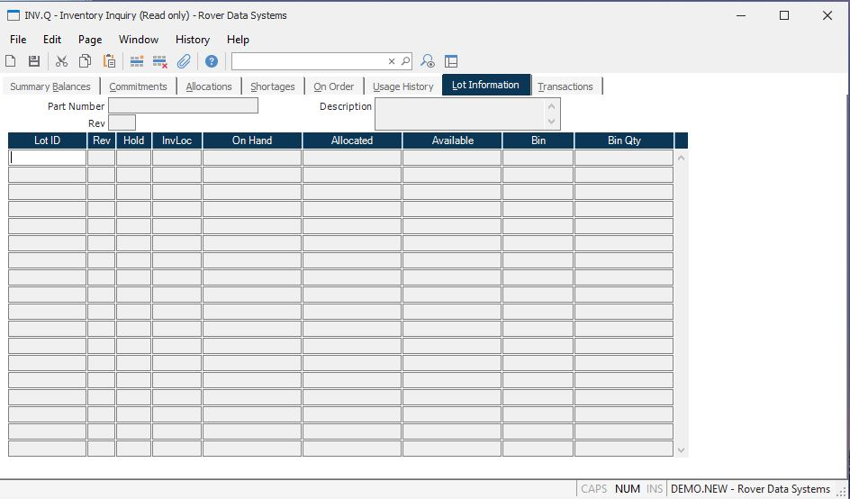

##  Inventory Inquiry (INV.Q)

<PageHeader />

##  Lot Information

**Lot ID** Contains all of the lot numbers which have an on-hand balance or
allocation for the part.  
  
**Rev** Displays the revision of the parts in the associated lot number.  
  
**Hold** The hold code currently placed on the associated lot.  
  
**Loc** The inventory locations which currently have a balance on-hand or
allocation posted for the  
lot.  
  
**On-Hand Quantity** The current on-hand balance of the lot at the associated
location.  
  
**Allocated Quantity** The quantity of the lot currently allocated at the
associated location.  
  
**Available Quantity** The quantity currently available at the associated
location.  
  
**Bin Loc** The bin locations associated with the lot.  
  
**Bin Qty** Contains the quantity on hand in the associated bin number for the
lot.  
  
**Part Number** The part number whose lot information is being displayed.  
  
**Description** Contains the description of the part number selected.  
  
  
<badge text= "Version 8.10.57" vertical="middle" />

<PageFooter />