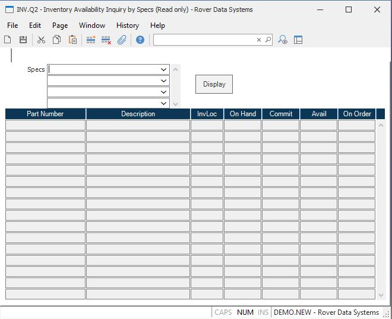

##  Inventory Availability Inquiry by Specs (INV.Q2)

<PageHeader />

##

**ID** This field is not prompted in this inquiry.  
  
**Specs** Enter the specifications for which part and inventory information
will be retrieved. Any part numbers with and inventory status (INV record) and
which match all specs entered will be displayed.  
  
**Display** Use this button to display / refresh the information to the
screen, based upon the specifications chosen.  
  
**Part.Number** This field contains the part number for which inventory status
is being displayed.  
  
**Description** This field contains the description as found in the Parts
file. Only the first line of the desc- ription is displayed.  
  
**Loc** All inventory locations for the part number are displayed.  
  
**On.Hand** This field contains the on hand inventory balance for the part
number being displayed. This is the total on hand balance, not accounting for
on order or committed quantities.  
  
**Committed** The total quantity committed to orders for the part number at
the associated inventory location.  
  
**Avail** The total quantity available for the part number at the associated
inventory location.  
  
**On Order**  
  
  
<badge text= "Version 8.10.57" vertical="middle" />

<PageFooter />