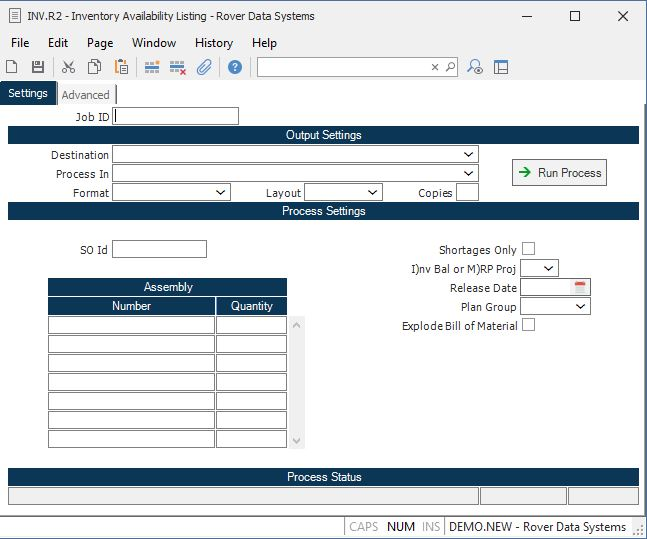

##  Inventory Availability Listing (INV.R2)

<PageHeader />

##

**Job ID** Enter a unique ID if you wish to enter and save the parameters to
this procedure for future use. If you only need to run the procedure and do
not want to save your entry then you may leave this field empty.  
  
**Destination** Select the destination for the output from this procedure.  
  
**Process** Select the method to be used for processing the report. Foreground
is always available and must be used when output is directed to anything other
than a system printer (i.e. printers spooled through the database on the host
computer.) Depending on your setup there may be various batch process queues
available in the list that allow you to submit the job for processing in the
background or at a predefined time such as overnight. A system printer must be
specified when using these queues.  
  
**Format** Select the format for the output. The availability of other formats
depends on what is allowed by each procedure. Possible formats include Text,
Excel, Word, PDF, HTML, Comma delimited and Tab delimited.  
  
**Layout** You may indicate the layout of the printed page by specifying the
appropriate setting in this field. Set the value to Portrait if the page is to
be oriented with the shorter dimension (usually 8.5 inches) at the top or
Landscape if the longer dimension (usually 11 inches) is to be at the top.
Portrait will always be available but Landscape is dependent on the output
destination and may not be available in all cases.  
  
**Copies** Enter the number of copies to be printed.  
  
**Run Process** Click on the button to run the process. This performs the save
function which may also be activated by clicking the save button in the tool
bar or pressing the F9 key or Ctrl+S.  
  
**SO Id** If you wish to load in the assemblies entered against a particular
sales order, enter the sales order number in this field. The total scheduled
quantity for the line item will be loaded into the QUANTITY field on this
screen. Please note that using this option will not delete any assemblies
already entered on this screen. Instead the parts entered against the sales
order will be added to the list.  
  
**Assembly Number** Enter the numbers of all of the assemblies you want to
have included in the report.  
  
**Quantity** Enter the quantity by which the associated assembly is to be
extended and checked against inventory.  
  
**Shortages Only** Check this box if you want to include only those items with
a projected shortage.  
  
**I)nv Bal or M)RP Proj** You have the option of using the current inventory
balance or the MRP projected balance to determine the shortages for the
assembly. Enter the letter "I" for inventory, or "M" for MRP.  
  
**Plan Group** If you selected option "M" in the previous prompt you may
specify the proposed date on which the materials would be pulled from
inventory. This date is used to determine what period in the MRP to look at
for the projected balance. If nothing is entered at this prompt then the
current date is assumed.  
  
**Plan Group** Enter the planning group which you wish to use for this report.
This field will control the MRP quantities and the available inventory
locations to use.  
  
**Explode Bill of Material** Check this box if you wish all levels of the bill
of material to be included in this report. If this box is not checked, the
requirements will only show for the first level of the bill of material.
Please note that if this option is selected, that while he components required
on the sub-assemblies will appear on the report, the sub-assembly numbers
themselves will not appear on the report.  
  
**Last Status Message** Contains the last status message generated by the
program.  
  
**Last Status Date** The date on which the last status message was generated.  
  
**Last Status Time** The time at which the last status message was generated.  
  
  
<badge text= "Version 8.10.57" vertical="middle" />

<PageFooter />