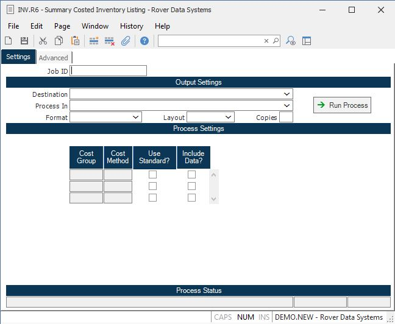

##  Summary Costed Inventory Listing (INV.R6)

<PageHeader />

##

**Job ID** Enter a unique ID if you wish to enter and save the parameters to
this procedure for future use. If you only need to run the procedure and do
not want to save your entry then you may leave this field empty.  
  
**Destination** Select the destination for the output from this procedure.  
  
**Process** Select the method to be used for processing the report. Foreground
is always available and must be used when output is directed to anything other
than a system printer (i.e. printers spooled through the database on the host
computer.) Depending on your setup there may be various batch process queues
available in the list that allow you to submit the job for processing in the
background or at a predefined time such as overnight. A system printer must be
specified when using these queues.  
  
**Format** Select the format for the output. The availability of other formats
depends on what is allowed by each procedure. Possible formats include Text,
Excel, Word, PDF, HTML, Comma delimited and Tab delimited.  
  
**Layout** You may indicate the layout of the printed page by specifying the
appropriate setting in this field. Set the value to Portrait if the page is to
be oriented with the shorter dimension (usually 8.5 inches) at the top or
Landscape if the longer dimension (usually 11 inches) is to be at the top.
Portrait will always be available but Landscape is dependent on the output
destination and may not be available in all cases.  
  
**Copies** Enter the number of copies to be printed.  
  
**Run Process** Click on the button to run the process. This performs the save
function which may also be activated by clicking the save button in the tool
bar or pressing the F9 key or Ctrl+S.  
  
**Cost Group** These are the cost groups as defined in [ INV.CONTROL ](../../../INV-ENTRY/INV-CONTROL/README.md) . The cost method assigned to the cost group will default into the subsequent entry for cost method. The cost group is used to retrieve the correct unit cost from the COST and inventory records. The cost group and method cannot be changed, but are displayed for the use of the subsequent check boxes.   
  
**Cost Method** The system will pre-load the cost method defined in the [ INV.CONTROL ](../../../INV-ENTRY/INV-CONTROL/README.md) procedure associated with the cost group(s). If the method is lot costing then lot cost will be used for all lot controlled parts and average cost will be used for non-lot controlled parts. If you wish to run the report for standard costs for the cost group, check the next box.   
  
**Use Std?** Check this box if you want to use the standard cost for this cost
group instead of the method defined for this cost group. For example, if you
are using an average cost method but maintaining standards, you may want to
run the report for the standards to check against your averages.  
  
**Include Data?** This box is defaulted to checked, but can be unchecked if
you don't want to include data for this cost group. This would only apply if
you have multiple cost groups and you wanted to run the report for only one
group.  
  
**Last Status Message** Contains the last status message generated by the
program.  
  
**Last Status Date** The date on which the last status message was generated.  
  
**Last Status Time** The time at which the last status message was generated.  
  
  
<badge text= "Version 8.10.57" vertical="middle" />

<PageFooter />