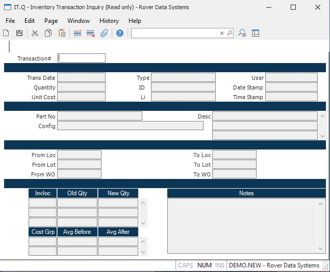

##  Inventory Transaction Inquiry (IT.Q)

<PageHeader />

##

**Transaction Number** Enter the number of the inventory transaction you want
to view.  
  
**Date** The post date of the transaction. This date is usually the actual date on which the transaction was entered, however procedures such as [ RECEIPTS.E ](../../../../PUR-OVERVIEW/PUR-ENTRY/RECEIPTS-E/README.md) and [ SHIP.E2 ](../../../../MRK-OVERVIEW/MRK-ENTRY/SHIP-E2/README.md) may allow the user to set this date.   
  
**Quantity** The quantity moved by the transaction.  
  
**Unit Cost** The unit cost used by the transaction.  
  
**Type** The type or name of the procedure that created the transaction.  
  
**ID** The record ID of the item that created the transaction.  
  
**Li** If there are individual line items associated with the record, then the
line item associated with the transaction is displayed here.  
  
**User Id** The login ID of the user who created the transaction.  
  
**Part No** The part number moved by the transaction.  
  
**Config ID** The configuration ID of the item moved.  
  
**Desc** The description of the part moved.  
  
**From Loc** The inventory location from which the item was moved.  
  
**From Lot** The lot number from which the item was moved.  
  
**From WO** The work order from which the item was moved.  
  
**To Loc** The inventory location to which the item was moved.  
  
**To Lot** The lot number to which the item was moved.  
  
**To WO** The work order to which the item was moved.  
  
**InvLoc** The list of inventory locations.  
  
**Old Qty** The quantity shown for each location before the transaction was
posted.  
  
**New Qty** The quantity shown for each location after the transaction was
posted.  
  
**Cost Group** This field contains the cost group(s) for this part.  
  
**Grp Cost Before** This field contains the average cost of this part for the
associated cost group, before this transaction.  
  
**Grp Cost After** This field contains the average cost for this cost group,
after the transaction.  
  
**Date Stamp** This field contains the date the transaction was created. This
will usually be the same as the transaction date but it may not always be the
same.  
  
**Time Stamp** The time the transaction was created.  
  
**Notes** This field contains any notes that were entered about the
transaction.  
  
  
<badge text= "Version 8.10.57" vertical="middle" />

<PageFooter />