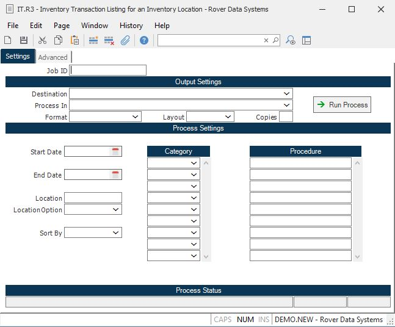

##  Inventory Transaction Listing for an Inventory Location (IT.R3)

<PageHeader />

##

**Job ID** Enter a unique ID if you wish to enter and save the parameters to
this procedure for future use. If you only need to run the procedure and do
not want to save your entry then you may leave this field empty.  
  
**Destination** Select the destination for the output from this procedure.  
  
**Process** Select the method to be used for processing the report. Foreground
is always available and must be used when output is directed to anything other
than a system printer (i.e. printers spooled through the database on the host
computer.) Depending on your setup there may be various batch process queues
available in the list that allow you to submit the job for processing in the
background or at a predefined time such as overnight. A system printer must be
specified when using these queues.  
  
**Format** Select the format for the output. The availability of other formats
depends on what is allowed by each procedure. Possible formats include Text,
Excel, Word, PDF, HTML, Comma delimited and Tab delimited.  
  
**Layout** You may indicate the layout of the printed page by specifying the
appropriate setting in this field. Set the value to Portrait if the page is to
be oriented with the shorter dimension (usually 8.5 inches) at the top or
Landscape if the longer dimension (usually 11 inches) is to be at the top.
Portrait will always be available but Landscape is dependent on the output
destination and may not be available in all cases.  
  
**Copies** Enter the number of copies to be printed.  
  
**Run Process** Click on the button to run the process. This performs the save
function which may also be activated by clicking the save button in the tool
bar or pressing the F9 key or Ctrl+S.  
  
**Start Date** Enter the date for which you want the transaction listing to
begin.  
  
**End Date** Enter the date on which you want the transaction listing to end.  
  
**Inventory Location** The location entered at this prompt is used to
determine which transactions to include in the listing. Only those
transactions with the location entered will be included. Entry of a location
is mandatory.  
  
**Location Option** Enter FROM in this field if you only wish to include
inventory transactions that moved material out of the selected location. Enter
TO in this field if you only wish to include inventory transactions that moved
material in the selected location. Leave this field blank or enter ALL to
include transactions that moved material into and out of the selected
location.  
  
**Sort by** Select the method - transaction date or part number - that you
wish to sort the report by. If this field is left blank, the report will be
sorted by transaction date.  
  
**Category** If you wish to limit this report to certain catergories of parts,
enter those categories here.  
  
**Procedure** If you wish to limit the report to transactions created from certain procedures, enter the procedure names here. For example, if you only wanted to see the transactions created for purchase order receipts, you would enter [ RECEIPTS.E ](../../../../PUR-OVERVIEW/PUR-ENTRY/RECEIPTS-E/README.md) (receipt process), [ RECEIPTS.E2 ](../../../../PUR-OVERVIEW/PUR-ENTRY/RECEIPTS-E2/README.md) (debit receipt process) and [ RECEIPTS.E3 ](../../../../PUR-OVERVIEW/PUR-ENTRY/RECEIPTS-E3/RECEIPTS-E3/README.md) (receipt reversal process). For miscellaneous inventory transactions you would enter [ IT.E ](../../../INV-ENTRY/IT-E/README.md) or [ IT.E2 ](../../../../../rover/INV-OVERVIEW/INV-ENTRY/IT-E2/README.md) ..   
  
**Last Status Message** Contains the last status message generated by the
program.  
  
**Last Status Date** The date on which the last status message was generated.  
  
**Last Status Time** The time at which the last status message was generated.  
  
  
<badge text= "Version 8.10.57" vertical="middle" />

<PageFooter />