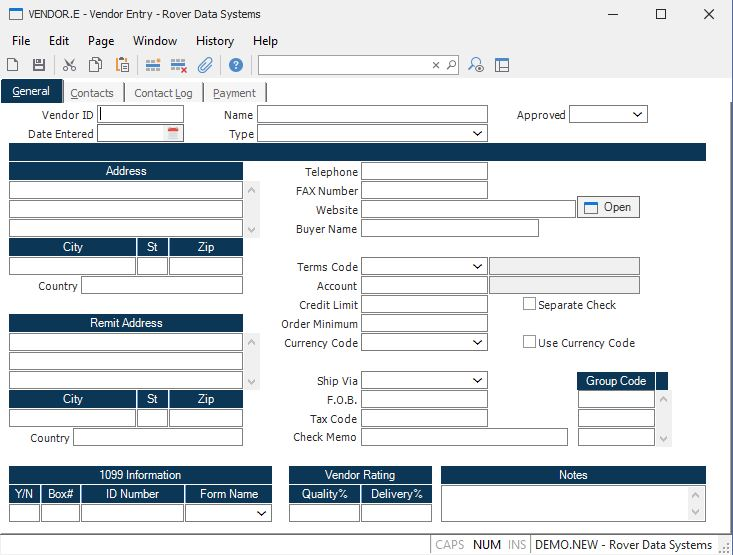
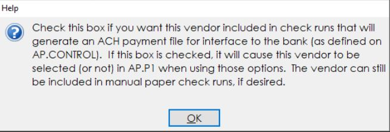
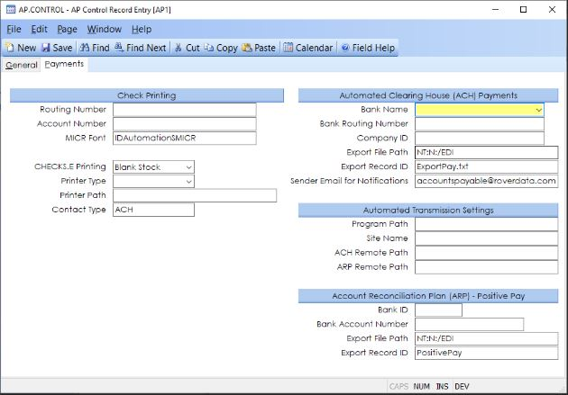
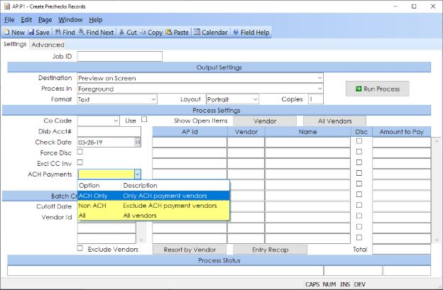
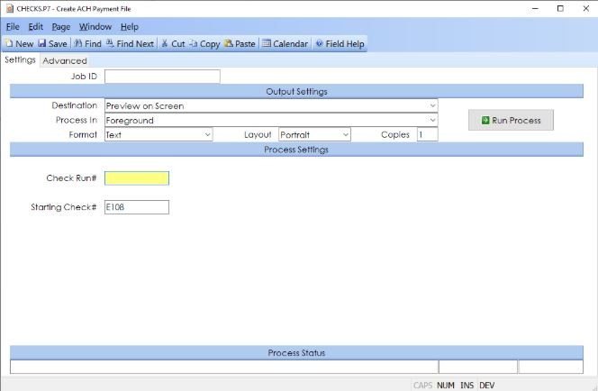
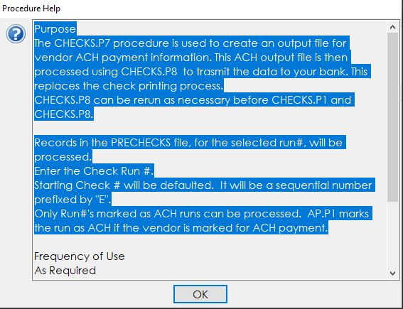
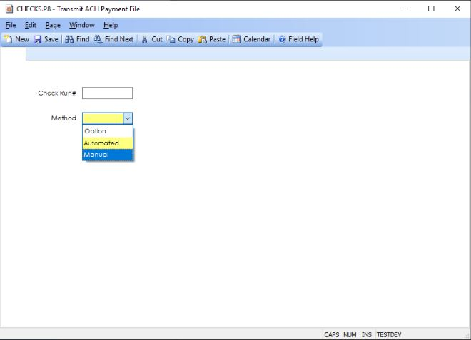
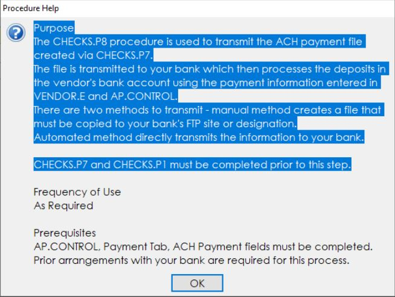

# ACH Payments

<PageHeader />
STEP 1 - SETUP 

1. VENDOR.E 

PAY USING ACH Field Help 

2. AP.CONTROL 

Note: Changes may be required to the format of the file that is transmitted to your bank. 

STEP 2 - Create Check Run for ACH Payments 

1. Enter the check run via AP.P1 

2. Create ACH payment File  

Procedure help for CHECK.P7 

3. Post the check run via CHECKS.P1 

4. Transmit ACH file via CHECKS.P8 

Procedure help for CHECKS.P8 

If the transmission method is set to “automated”, M3 services must be running on the server and the first 3 fields in the “automated transmission settings” section of AP.CONTROL must be populated. 

 The commands referenced in this document are part of the accounts payable module. 

 
<PageFooter />
