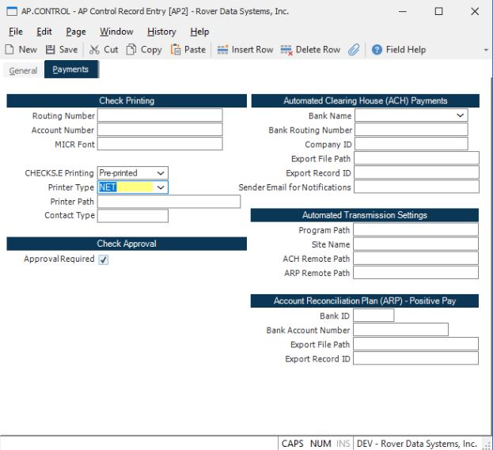
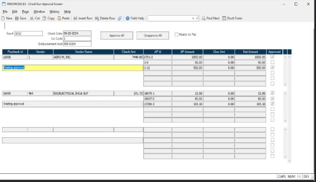
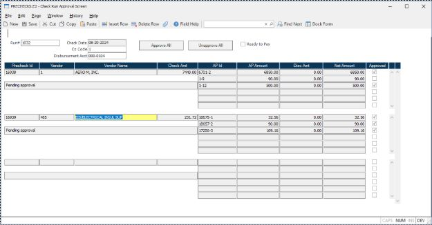
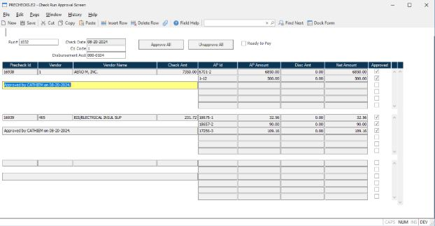
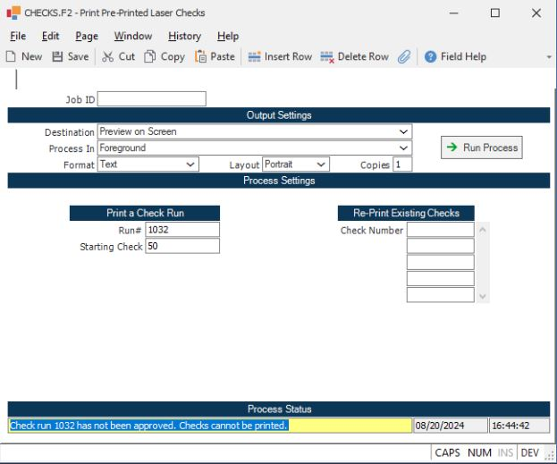

# AP Check Run Approval Process 

<PageHeader />
## Overview

This process only applies to check runs created from **AP.P1**.

Checks created via **CHECKS.E**, **CHECKS.E4**, or **COMM.P3** (commission check run process) do not require approval.

---

## Setup

In **AP.CONTROL**, check the **Approval Required** box.

- If this box is not checked, you can print/post check runs that have not been approved

---

## Process Steps

**1. Create the Check Run**

Create the check run in **AP.P1** as you normally would.

**2. Approve Invoices in PRECHECKS.E2**

Open the check run in **PRECHECKS.E2** to approve invoices.

- The **Approve All** button will check the **Approved** box for all AP IDs
- The **Unapprove All** button will uncheck the **Approved** box for all AP IDs
- When you first open the run in PRECHECKS.E2, the status message will show as **"Waiting Approval"** because no invoices have been approved yet

Once saved, the system will remember which invoices have been approved or unapproved. The status will change to **"Pending Approval"**.

**3. Mark Ready to Pay**

When ready to print the checks, check the **Ready to Pay** box.

- When the record is saved, any invoice that is **not** marked as approved will be removed from the PRECHECK record
- For example, if AP ID `1-9` was not approved, it will no longer appear in PRECHECKS.E2
- The status message will show who approved the ID and when it was approved

**4. Reapproval After Changes**

If any changes are made in **PRECHECKS.E**, the record will need to be reapproved.

---

## Important Notes

- Check runs **cannot** be printed or posted in **CHECKS.P1** if the entire check run has not been approved
- An error will be generated if at least one precheck record remains unapproved at the time of printing or posting

<PageFooter />
