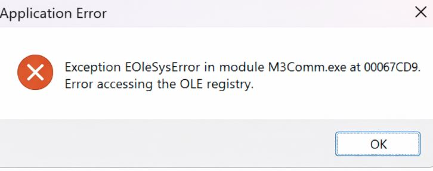

# Application Error Upon Logging In (Legacy Client)

<PageHeader />

<badge text='Administration' vertical='middle' />

---

## Resolution Steps

### 1. Repair the M3 Client Installation

1. Open **Control Panel** > **Programs** > **Uninstall a program**
2. Locate **Millenium 3** in the list of installed programs
3. Click **Change**
4. Select the **Repair** option
5. Follow the prompts to complete the repair process

### 2. Reinstall the M3 Client (If Repair Fails)

If repairing the installation does not resolve the issue:

1. Uninstall the M3 client completely
2. Download or obtain the latest version of the M3 client installer
3. Perform a fresh installation of the client

---

## Verification

- [ ] After repairing or reinstalling, attempt to log in to M3
- [ ] Confirm that the error message no longer appears and that the application launches successfully

---

> **Note:**
> Administrative privileges may be required to repair or reinstall the M3 client.
> If the issue persists after a fresh install, consult your IT administrator or RoverERP support for further assistance.

---

## Additional Information

- Regularly update Windows and ensure updates complete successfully to prevent registry corruption
- Always back up important data before performing repairs or reinstallations

<PageFooter />
