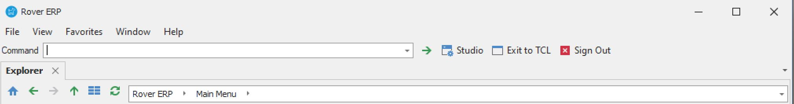
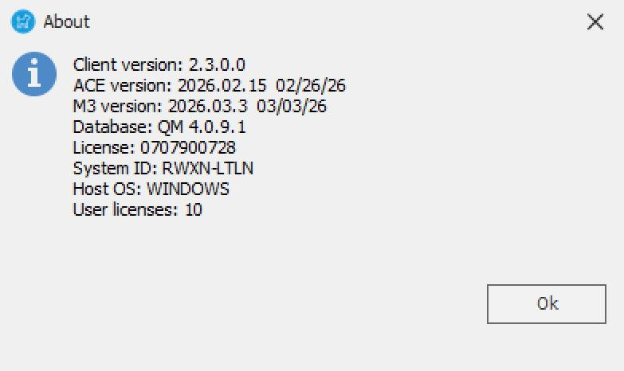

# How to Check Software Versions in RoverERP

<PageHeader />

<badge text='Administration' vertical='middle' />

## Problem Statement

Users need to identify the current software versions of the RoverERP client, ACE, M3, and database (QM) components.

---

## Symptoms

- Uncertainty about which versions of RoverERP components are installed
- Need to verify software versions for troubleshooting, support, or compliance purposes

---

## Cause

- Software version information is required for support, upgrades, or compatibility checks

---

## Resolution Steps

1. **Access the Main Menu**

   Open RoverERP and navigate to the main menu.

2. **Go to Help > About**

   Click on **Help** in the menu bar and select **About** from the dropdown menu.

3. **View Version Information**

   A dialog box will appear displaying the following version details:

   - Client version
   - ACE version
   - M3 version
   - Database (QM) version

---

## Verification

- [ ] Confirm that the dialog box displays all relevant version numbers
- [ ] Record or screenshot the version information as needed for support or documentation

---

## Note

- Always provide complete version information when contacting support or planning upgrades
- Regularly check for updates to ensure you are running supported versions

---

## Additional Information

- If you are unable to access the version information, contact your system administrator or RoverERP support for assistance

<PageFooter />
