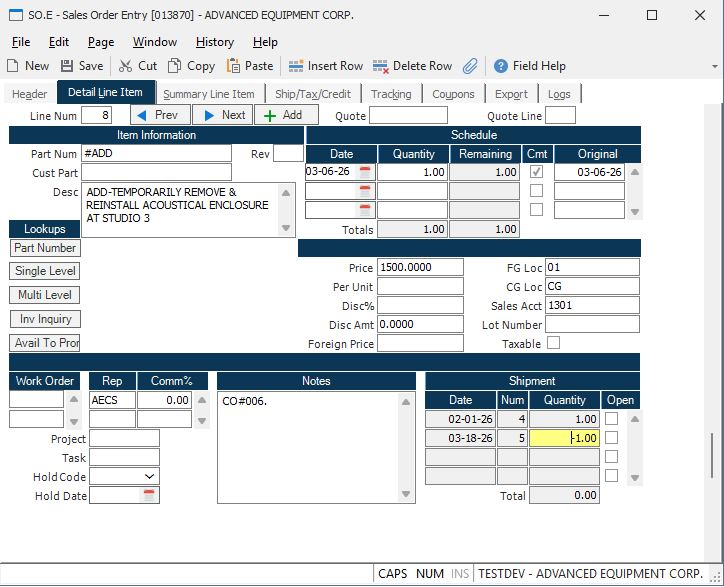

# How to Reverse a Shipment or Specific Line Items in RoverERP

<PageHeader />

## Problem Statement

Users need to reverse an entire shipment or specific line items on a shipper in RoverERP. The goal is to properly offset the original shipment, update inventory, and ensure accurate financial and order records, without deleting the original shipper.

---

## Symptoms

- A shipment or specific line items need to be reversed due to errors or changes in fulfillment
- Users are unsure how to reverse shipments or line items without deleting the original shipper
- There is a need to ensure inventory and invoicing are correctly updated after reversal

---

## Cause

- Shipments may need to be reversed due to incorrect fulfillment, customer returns, or other adjustments
- Deleting the original shipper is not permitted; instead, a reversing transaction must be created to maintain audit trails and accurate records

---

## Resolution Steps

### Reverse an Entire Shipment

1. Navigate to: **Shipping > SHIP.E3** (Reverse Shipper)
2. Select the shipper you wish to reverse
3. Execute the reversal process
4. The system will create a new reversing shipper to offset the original shipment

### Reverse Specific Line Items

1. Navigate to: **Shipping > SHIP.E6** (Reverse Shipper Line Items)
2. Select the shipper and the specific line items to reverse
3. Execute the reversal process
4. A reversing shipper will be created for the selected line items

### Understand the Effects of Reversal

- The original shipper is not deleted
- Inventory is reversed for the affected items
- When the reversing shipper is posted, a credit memo is created to apply against the original invoice
- The line items on the sales order are re-opened, but the original shipper remains visible on the line item
- Once a shipper has been applied to a line item, the line cannot be deleted, but the quantity can be set to zero if needed

---

## Verification

- [ ] Confirm that a reversing shipper has been created and is visible in the system
- [ ] Check that inventory levels have been updated to reflect the reversal
- [ ] Verify that a credit memo has been generated and applied to the original invoice
- [ ] Ensure that the sales order line items are re-opened and both the original and reversing shipments are displayed

---

> **Note:**  
> The reversal process maintains a complete audit trail by retaining the original shipper and creating a reversing transaction. Deleting the original shipper is not supported; always use the reversal functions for corrections.

---

## Additional Information

- For complex reversals or if you encounter issues, contact RoverERP support for assistance
- Always review the impact on inventory and financial records after performing a reversal

---

<PageFooter />
