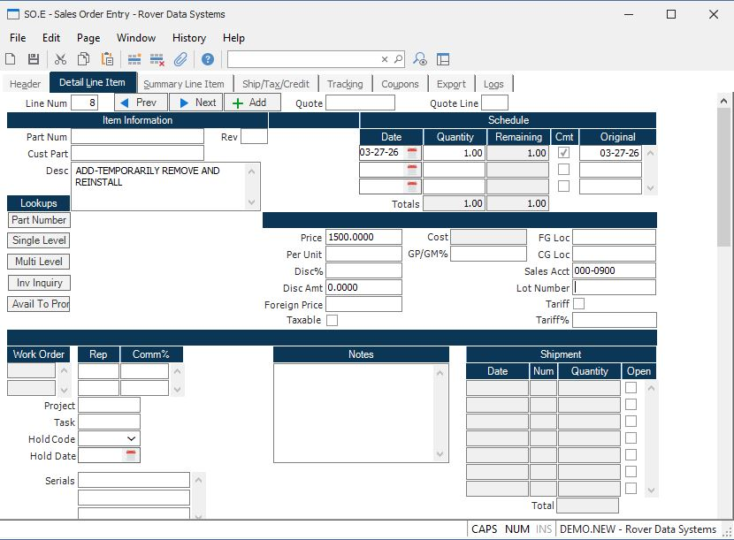

# How to Reverse a Shipment or Specific Line Items in RoverERP

<PageHeader />

---

## Resolution Steps

### Reverse an Entire Shipment

1. Navigate to: **Shipping > SHIP.E3** (Reverse Shipper)
2. Select the shipper you wish to reverse
3. Execute the reversal process
4. The system will create a new reversing shipper to offset the original shipment

### Reverse Specific Line Items

1. Navigate to: **Shipping > SHIP.E6** (Reverse Shipper Line Items)
2. Select the shipper and the specific line items to reverse
3. Execute the reversal process
4. A reversing shipper will be created for the selected line items

### Understand the Effects of Reversal

- The original shipper is not deleted
- Inventory is reversed for the affected items
- When the reversing shipper is posted, a credit memo is created to apply against the original invoice
- The line items on the sales order are re-opened, but the original shipper remains visible on the line item
- Once a shipper has been applied to a line item, the line cannot be deleted, but the quantity can be set to zero if needed

---

<PageFooter />
