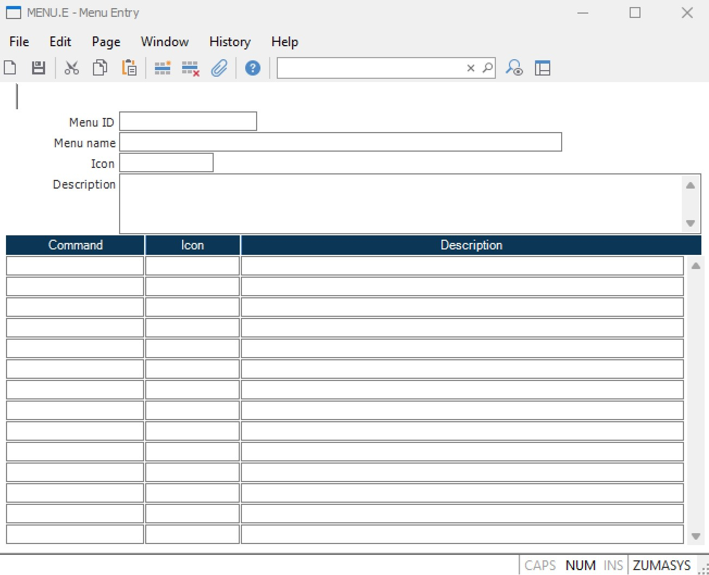

# MENU.E - Menu Entry

<PageHeader />

## Overview

**MENU.E** is the Menu Entry procedure used to create and modify system menus in M3. This powerful tool allows you to add commands to existing menus, create custom menus, and organize your workflow by grouping related procedures together.

**Location:** ACE module > Data Entry menu

## Getting Started

To access MENU.E:
1. Navigate to the ACE module
2. Select Data Entry from the main menu
3. Choose MENU.E from the list

The first field prompts for the menu ID and provides a lookup of available menus.

<!--  -->
<!-- *MENU.E main entry screen showing the Menu ID field and lookup functionality* -->

## Understanding Menu Structure

### Standard Menu Hierarchy

Most modules within M3 follow a consistent three-level menu structure:

1. **Primary Menu** - Main module menu (e.g., `AP.MENU`, `AR.MENU`)
2. **Sub-menus** - Functional categories within each module:
   - **Data Entry** (e.g., `AP.ENTRY`) - Input forms and data entry screens
   - **Reports and Inquiries** (e.g., `AP.REPORT`) - Reports, forms, and query screens  
   - **Processes** (e.g., `AP.PROCESS`) - Batch processes and utilities

### Example: Accounts Payable Structure

```
AP.MENU (Primary Menu)
├── AP.ENTRY (Data Entry Sub-menu)
├── AP.REPORT (Reports and Inquiries Sub-menu)
└── AP.PROCESS (Process Sub-menu)
```

<!--  -->
<!-- *Visual representation of the standard M3 menu hierarchy* -->

## Working with MENU.E

### Menu Entry Screen Fields


*Complete MENU.E entry form with all available fields*

| Field | Description |
|-------|-------------|
| **Menu ID** | The unique identifier for the menu record |
| **Menu Name** | Descriptive name displayed at the top of the menu |
| **Menu Icon** | Icon displayed with the menu item (right-click for options) |
| **Menu Description** | Text shown in the browser details section |
| **Command** | The command name executed when the menu item is selected |
| **Command Icon** | Icon displayed with the associated command |
| **Description** | Description of the command functionality |

### Step-by-Step: Adding Commands to Existing Menus

#### 1. Select the Target Menu
1. Enter the menu ID in the first field (e.g., `MRK.REPORT` for Marketing reports)
2. Use the lookup function (F4) to browse available menus
3. Press Enter to load the selected menu

<!--  -->
<!-- *Selecting a target menu using the lookup function* -->

#### 2. Add New Command Entry
1. Navigate to an empty line in the menu
2. Enter the command name in the **Command** field
3. Add a descriptive title in the **Description** field
4. Select an appropriate icon from the available options
5. Save the changes

<!--  -->
<!-- *Adding a new command to an existing menu* -->

#### 3. Verify the Addition
1. Exit MENU.E
2. Navigate to the modified menu
3. Confirm the new command appears correctly
4. Test the command functionality

### Best Practices for Command Placement

Follow these guidelines when adding new commands:

- **Sales Reports** → Add to `MRK.REPORT` (Sales/Marketing Reports menu)
- **Custom Reports** → Add to the most relevant module's report menu
- **Utilities** → Add to the appropriate process menu
- **Data Entry Forms** → Add to the relevant entry menu

<!--  -->
<!-- *Visual guide showing proper command placement across different menu types* -->

## Creating Custom Menus

### When to Create Custom Menus

Custom menus are beneficial for:
- **Department-specific workflows** - Consolidate frequently used functions
- **Role-based access** - Create specialized menus for different user types
- **Project-specific tools** - Group related procedures for specific projects
- **Training environments** - Simplified menus for new users

### Step-by-Step: Creating a New Menu

#### 1. Plan Your Menu Structure
- Identify the commands to include
- Determine logical groupings
- Choose descriptive names and icons

#### 2. Create the Menu Record
1. Access MENU.E
2. Enter a new, unique Menu ID (e.g., `SALES.CUSTOM`)
3. Add a descriptive Menu Name
4. Set the menu icon and description

<!--  -->
<!-- *Creating a new custom menu with proper naming conventions* -->

#### 3. Add Menu Items
1. Add each command with appropriate descriptions
2. Organize items logically (group related functions)
3. Use consistent icon styles
4. Test each command link

#### 4. Deploy and Test
1. Save the completed menu
2. Test all command links
3. Train users on the new menu structure
4. Gather feedback for improvements

<!--  -->
<!-- *Example of a well-organized custom menu for sales operations* -->

## Advanced Features

### Menu Organization Tips

1. **Group Related Functions** - Keep similar commands together
2. **Use Descriptive Names** - Make command purposes clear
3. **Consistent Icons** - Use similar icon styles within menus
4. **Logical Order** - Arrange commands by frequency of use

### Icon Management

MENU.E provides various icon options:
- Right-click in icon fields to see available options
- Use consistent icons for similar command types
- Consider visual hierarchy when selecting icons

<!--  -->
<!-- *Icon selection interface showing available options* -->

### Security Considerations

**Important:** Menu visibility is controlled by user security settings. Users will only see menu items they have permission to access, even if the item appears in MENU.E.

- Items without security access won't display for restricted users
- Use SECURITY.E to manage user access permissions
- Test menus with different user security levels

## Report Integration

### Compatible Report Types

| Report Writer | Menu Compatible | Notes |
|---------------|----------------|-------|
| **RD.E** | ✅ Yes | Standard report writer - fully compatible |
| **RP.E** | ✅ Yes | Professional report writer - fully compatible |
| **REPORT.E** | ❌ No | Legacy report writer - cannot be added to menus |
| **RW.E** | ❌ No | Report writer - cannot be added to menus |

### Adding Reports to Menus

1. Ensure the report is created using RD.E or RP.E
2. Note the exact report command name
3. Add to the appropriate reports menu
4. Test report execution from the menu

<!--  -->
<!-- *Adding reports to menus with proper command syntax* -->

## Troubleshooting

### Common Issues and Solutions

| Issue | Solution |
|-------|----------|
| Command doesn't appear in menu | Check user security permissions |
| Menu item shows but won't execute | Verify command name spelling and syntax |
| Icons not displaying | Ensure icon names are valid and exist |
| Menu changes not visible | Clear browser cache or restart M3 session |

### Validation Checklist

Before deploying menu changes:
- [ ] All command names are spelled correctly
- [ ] Icons display properly
- [ ] Descriptions are clear and helpful
- [ ] Security permissions are appropriate
- [ ] Menu organization is logical
- [ ] All commands execute successfully

## Related Documentation

For additional information, see:
- [SECURITY.E](../SECURITY-E/) - Managing user permissions
- [RD.E](../RD-E/) - Report writer for menu-compatible reports
- [Menu Structure Overview](../../menu-structure/) - Complete menu hierarchy guide

<PageFooter />
