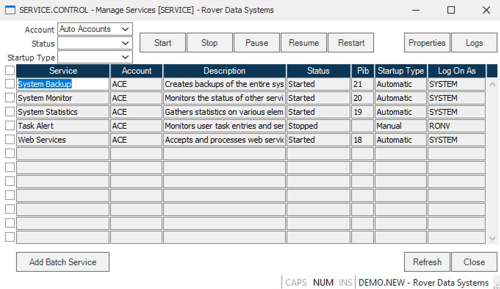

# Managing Account Services with SERVICE.CONTROL in RoverERP

<PageHeader />

<badge text='Administration' vertical='middle' />

## Problem Statement

Administrators need to view and manage scheduled services for all accounts defined in ACCOUNT.CONTROL, including scheduling procedures such as daily backups and nightly module updates.

---

## Symptoms

- Need to schedule, view, or manage automated procedures across multiple accounts
- Requirement to ensure critical services (e.g., backups, updates) run on a defined schedule
- Desire to manage services regardless of the currently logged-in account

---

## Cause

- **SERVICE.CONTROL** provides centralized management of account services and scheduled procedures
- Batch queue jobs must be defined within the specific account where they are to run

---

## Resolution Steps

1. **Access SERVICE.CONTROL**

   Navigate to: **ACE Utilities > SERVICE.CONTROL**.

2. **View and Manage Services**

   **SERVICE.CONTROL** displays all services for accounts defined in **ACCOUNT.CONTROL**. You can view, start, stop, or modify services for any account, regardless of your current login account.

3. **Schedule Procedures**

   Define schedules for procedures (e.g., daily backups, nightly updates) according to your organization's requirements. Use the scheduling options within **SERVICE.CONTROL** to set up when and how often each procedure should run.

4. **Defining Batch Queue Jobs**

   - Batch queue jobs are account-specific
   - Log into the account where the batch job should run before defining and setting up the job

5. **Accessing Help**

   For detailed information on any field, place the cursor in the field and press **F1** (help key). Context-sensitive help will be displayed.

---

## Verification

- [ ] Confirm that all required services are scheduled and running as intended
- [ ] Verify that batch queue jobs are defined in the correct accounts and execute on schedule
- [ ] Check logs or status screens to ensure procedures (e.g., backups, updates) complete successfully

---

## Note

- Use **SERVICE.CONTROL** for centralized management of all account services
- Always define batch queue jobs within the account where they are to be executed

---

## Additional Information

- For more detailed instructions, use the **F1** help feature within **SERVICE.CONTROL**
- Contact your system administrator or RoverERP support for assistance with complex scheduling or troubleshooting

<PageFooter />
