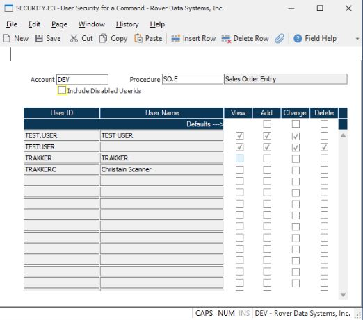

# Managing Procedure Access Rights with SECURITY.E3 in RoverERP

<PageHeader />

<badge text='Administration' vertical='middle' />

## Problem Statement

Administrators need to view and update access rights to specific procedures for all users in RoverERP, ensuring appropriate security and user permissions.

---

## Symptoms

- Need to review which users have access to a particular procedure
- Requirement to update, add, or remove user access rights for a procedure
- Desire to manage user security settings efficiently from a single screen

---

## Cause

- Changes in staff roles, responsibilities, or security policies require updates to procedure access rights
- New users may need to be granted access, or existing users may need their permissions modified

---

## Resolution Steps

1. **Access SECURITY.E3**

   Navigate to: **Security > SECURITY.E3**.

2. **Specify Account and Procedure**

   Enter the name of the account and the procedure for which you want to manage access rights.

3. **Review Current User Access**

   A list of all users with current access to the specified procedure will be displayed.

4. **Update Access Rights**

   - Modify the access rights for existing users as needed.
   - Add additional users who require access to the procedure.
   - Remove users who should no longer have access.

5. **Save Changes**

   After making the necessary updates, save the procedure. All user security settings for the specified procedure will be updated accordingly.

---

## Verification

- [ ] Confirm that the updated access rights are reflected for all users
- [ ] Ensure that only authorized users have access to the specified procedure

---

## Note

- Use **SECURITY.E3** to efficiently manage and audit user access to procedures across the organization
- Regularly review and update access rights to maintain security compliance

---

## Additional Information

- For complex security configurations or bulk updates, consult RoverERP support
- Document changes to user access for audit and compliance purposes

<PageFooter />
