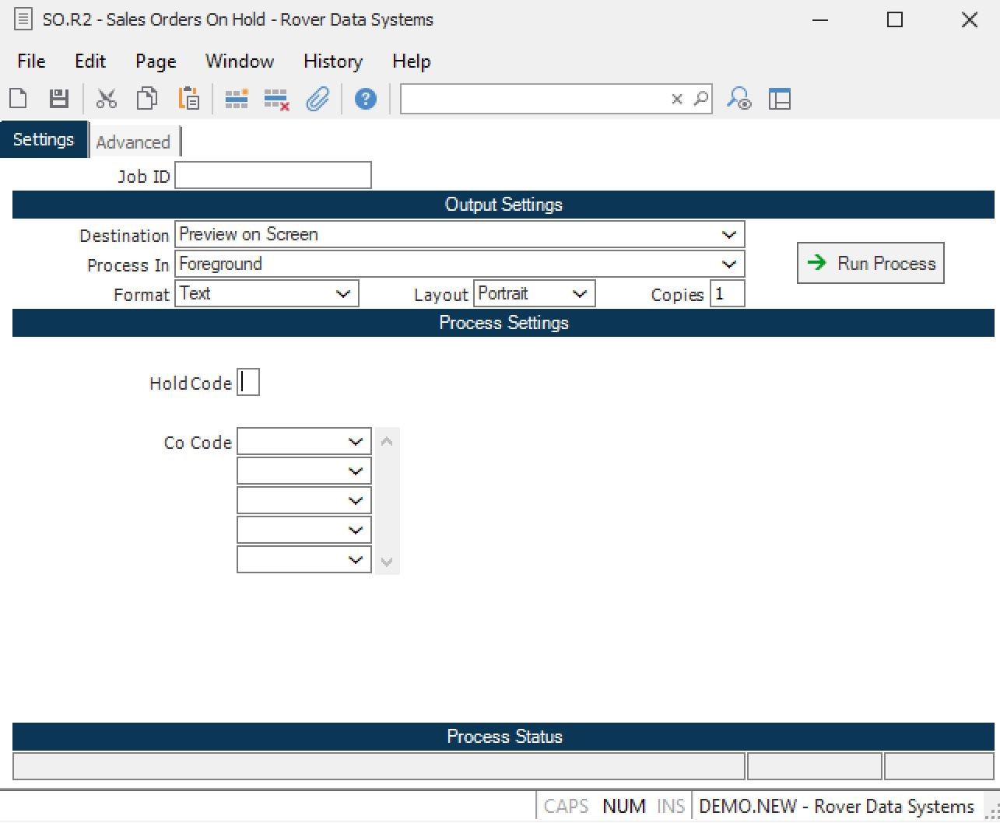

# Orders or Line Items on Hold Cannot Be Shipped in RoverERP

<PageHeader />

<badge text='Shipping' vertical='middle' />

## Problem Statement

Orders or line items that are on hold cannot be shipped in RoverERP.

---

## Symptoms

- Attempting to ship orders or line items that are on hold is not allowed
- Users need to identify which orders or line items are currently on hold

---

## Cause

In the standard RoverERP product, any order or line item placed on hold is restricted from being shipped.

---

## Resolution Steps

1. **List Orders on Hold**

   Run the **SO.R2** report. If you leave the hold code field blank, the report will list all orders currently on hold.

2. **Review and Release Holds as Needed**

   Review the report to identify orders or line items on hold. Release the hold as appropriate to allow shipping.

---

## Verification

- [ ] Confirm that only orders or line items not on hold can be shipped
- [ ] Verify that the **SO.R2** report accurately lists all orders on hold

---

## Note

- Orders or line items must be released from hold status before they can be shipped

---

## Additional Information

- For further assistance, contact RoverERP support

<PageFooter />
