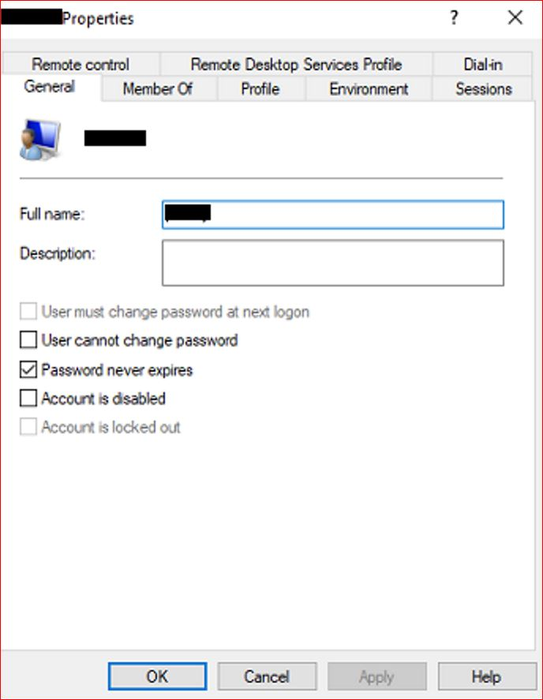

# Resolving "Invalid Username/Password" Error for a Single User in RoverERP

<PageHeader />

<badge text='Troubleshooting' vertical='middle' />

## Problem Statement

A user receives an "Invalid Username/Password" error when attempting to log in to RoverERP. This issue may be related to the user's account status on the Windows host server.

---

## Symptoms

- A single user cannot log in to RoverERP and receives an "Invalid Username/Password" error
- Other users are able to log in without issue
- The problem persists even when the correct credentials are entered

---

## Cause

- User accounts for RoverERP are created within RoverERP, but a corresponding Windows account is also created on the host server upon first login
- If the Windows account is locked out or disabled, the user will not be able to log in to RoverERP

---

## Resolution Steps

1. **Check the User Account on the Windows Host Server**

   - Open **Computer Management** on the host server
   - Expand the folder **Local Users and Groups**
   - Click on **Users**
   - Locate the user experiencing the issue
   - Right-click the user and select **Properties**
   - Ensure that the account is not locked out or disabled

2. **Unlock or Enable the Account if Needed**

   - If the account is locked out, uncheck the **Account is locked out** box
   - If the account is disabled, uncheck the **Account is disabled** box
   - Click **Apply** and **OK** to save changes

3. **Attempt Login Again**

   Have the user try logging in to RoverERP once the account status has been corrected.

---

## Verification

- [ ] The user is able to log in to RoverERP without receiving the "Invalid Username/Password" error
- [ ] The account remains active and accessible

---

## Note

- For SaaS clients, this issue will be handled by Zumasys Support
- Always verify both RoverERP and Windows account status when troubleshooting login issues

---

## Additional Information

- If the issue persists after confirming the account is active, contact RoverERP support for further troubleshooting
- Document any changes made to user accounts for audit purposes

<PageFooter />
