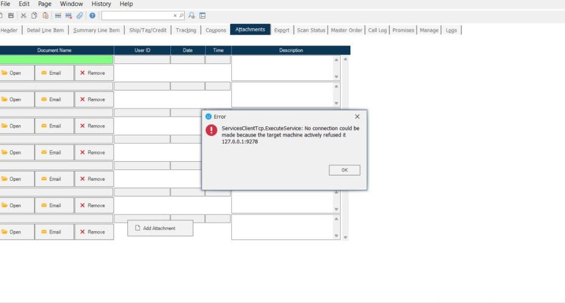

# Resolving ServicesClientTcp.ExecuteService Errors in RoverERP Due to Virus Blockers

<PageHeader />

<badge text='Administration' vertical='middle' />

---

---

## Resolution Steps

### 1. Identify the Security Software

- Determine which antivirus or endpoint protection software is installed on the affected system (for example, SentinelOne)

### 2. Check Security Logs

- Review the security software logs or quarantine list for any actions taken against RoverERP files or processes

### 3. Whitelist RoverERP Components

- Add RoverERP application files and network processes to the security software whitelist or allow list
- Ensure that all necessary ports and services used by RoverERP are permitted

### 4. Restart the Application

- After updating security settings, restart RoverERP and verify if the error persists

### 5. Contact IT or Security Team if Needed

- If you are unable to modify security settings, contact your IT or security administrator for assistance

---

<PageFooter />
